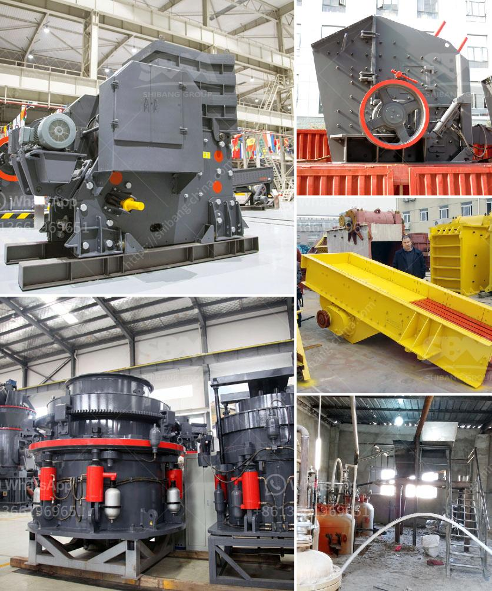

<h3>mobile crushers philippines</h3>
In recent years, the Philippines has witnessed a steady growth in its construction industry. With this rise in construction activities comes the need for efficient and cost-effective crushing equipment. Mobile crushers have emerged as an ideal solution for this demand, allowing contractors and quarry owners to easily move the crushing operation to different locations, reducing transportation costs and increasing operational efficiency.

Mobile crushers are compact machines designed to crush rocks, minerals, and other materials, often used in aggregates production, recycling applications, and mining operations. These crushers are mounted on heavy-duty tracks, allowing them to move easily on different terrains. This mobility ensures that the crushing operation can be carried out directly at the construction site or quarry, eliminating the need for expensive transportation of materials to a fixed crushing plant.

One of the significant advantages of mobile crushers is their capability to produce high-quality end products. With advancements in technology, mobile crushers are equipped with advanced features such as remote monitoring, real-time diagnostics, and automated control systems. These features ensure that the crushers can optimize the crushing process, resulting in consistent and uniform end products, whether it is crushed stone for construction or recycled aggregates for road base.

Moreover, mobile crushers are versatile machines that can handle a wide range of materials. From hard and abrasive rock to softer materials, mobile crushers can efficiently process various types of stones, ores, and minerals. This flexibility allows contractors and quarry owners to adapt to different projects and materials, maximizing the utilization of their mobile crushers.

Additionally, mobile crushers offer significant savings in operating costs. Since these crushers can operate independently and require minimal manual intervention, they reduce labor expenses. Furthermore, by crushing materials directly at the construction site or quarry, contractors can avoid transportation costs, which constitute a substantial part of the project budget. Mobile crushers also have lower fuel consumption compared to traditional crushers, further contributing to cost savings.

In the Philippines, the demand for mobile crushers has been steadily increasing due to its numerous advantages. Reputable manufacturers have introduced a wide range of mobile crushers designed to cater to different crushing needs. These crushers are designed to withstand rugged conditions and work efficiently in the harsh climates often experienced in the Philippines.

However, it is essential to ensure that mobile crushers are operated by skilled professionals who can maximize their efficiency and productivity while ensuring safety. Regular maintenance and inspections are also crucial to keep the mobile crushers in optimal condition and avoid unexpected breakdowns.

Mobile crushers have revolutionized the crushing industry in the Philippines, providing a cost-effective solution to crushing needs. With their mobility, versatility, and efficiency, mobile crushers have become an indispensable tool for contractors, quarry owners, and mining companies. As the construction industry continues to grow in the Philippines, mobile crushers are expected to play a vital role in meeting the demand for efficient crushing operations.
<h3>Contact us</h3><ul><li><strong>Whatsapp:&nbsp;<a href="https://wa.me/8613661969651">+8613661969651</a></strong></li><li><a href="https://swt.shibang-china.com/?git&amp;zhl&amp;mobile crushers philippines"><strong>Online Service(chat now)</strong></a></li></ul><h3>Related</h3><ul><li><a href='cornerstone equipment used rock crushers.md'>cornerstone equipment used rock crushers</a></li><li><a href='types of stone crusher and prices.md'>types of stone crusher and prices</a></li><li><a href='kaolin mining crusher process.md'>kaolin mining crusher process</a></li><li><a href='ball mill gypsum.md'>ball mill gypsum</a></li><li><a href='stone quarry crusher plant price in india.md'>stone quarry crusher plant price in india</a></li></ul>