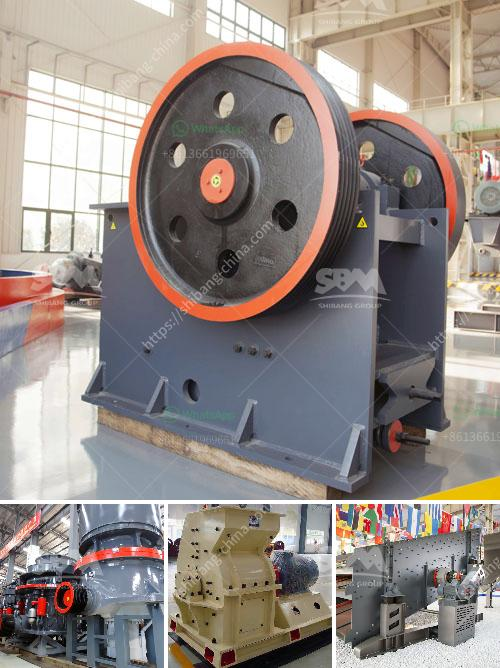

<h3>mobile crushers saudi</h3>
Saudi Arabia is abundant with mineral resources that have been mined for centuries. With its reserves of oil and gas, the country has been a destination for numerous mining operators over the years. With the increasing demand for mobile crushers in the mining industry, investing in this equipment can be a profitable move for future growth. Mobile crushers utilize the advantage of being able to move freely and easily all around the site, delivering the desired aggregates to the designated locations with ease. This enables mining operators to increase their overall productivity and reduce costs by eliminating the need for transportation.

One of the major challenges faced by mining operators is the pre-processing of raw materials, particularly in remote locations. Traditional crushers require heavy machinery, transportation vehicles, and a significant amount of time and effort to transfer materials from the mining site to the processing plant. This process can be time-consuming and costly. However, with the availability of mobile crushers in Saudi Arabia, this problem has been resolved.

Mobile crushers are of great importance in Saudi Arabia’s mining industry. The materials processed by them are easy to move and the finished products are easy to transport, thus reducing the transportation costs. These mobile crushers are able to process various rocks and ores like limestone, basalt, granite, and so on. The versatility and mobility help to increase productivity and reduce costs for the owner of the project.

In recent years, a construction boom has been witnessed in Saudi Arabia due to the high demand for infrastructure projects. This has driven the need for high-quality aggregates, making mobile aggregate crushers an important tool for modern construction projects. Mobile crushers are capable of crushing a variety of aggregates and minerals, making them an essential solution for contractors and mining operators.

Mobile crushers are also used for crushing stones at quarry sites as well as on-site recycling of construction waste such as concrete debris, stones, and other materials. These recycled materials can be utilized in the construction industry, thereby reducing the need for new resources and contributing to environmental sustainability.

To meet the demands of the customers, mobile crushers are available in a variety of sizes and capacities. The latest models are equipped with advanced features and technology to improve overall efficiency and deliver high-quality end products. These crushers are also designed to be durable, reliable, and require minimal maintenance, ensuring a longer lifespan and reduced downtime.

With the availability of mobile crushers in Saudi Arabia, the mining industry has fundamentally benefited. These machines provide ease of use, efficiency, and versatility in processing various types of materials. With lower operating costs and savings on transportation, mobile crushers help to shorten the time required for pre-processing and enable mining operators to quickly respond to market demands. As the mining industry in Saudi Arabia continues to grow, mobile crushers will remain an essential part of this growth, providing the necessary means to handle the raw materials in an efficient and cost-effective manner.
<h3>Contact us</h3><ul><li><strong>Whatsapp:&nbsp;<a href="https://wa.me/8613661969651">+8613661969651</a></strong></li><li><a href="https://swt.shibang-china.com/?git&amp;zhl&amp;mobile crushers saudi"><strong>Online Service(chat now)</strong></a></li></ul><h3>Related</h3><ul><li><a href='mini concrete crusher in united kingdom.md'>mini concrete crusher in united kingdom</a></li><li><a href='stone crusher plant cash receipt.md'>stone crusher plant cash receipt</a></li><li><a href='kobe vertical mill for slag grinding.md'>kobe vertical mill for slag grinding</a></li><li><a href='quarry plant for sale.md'>quarry plant for sale</a></li><li><a href='mobile crusher in codelco.md'>mobile crusher in codelco</a></li></ul>