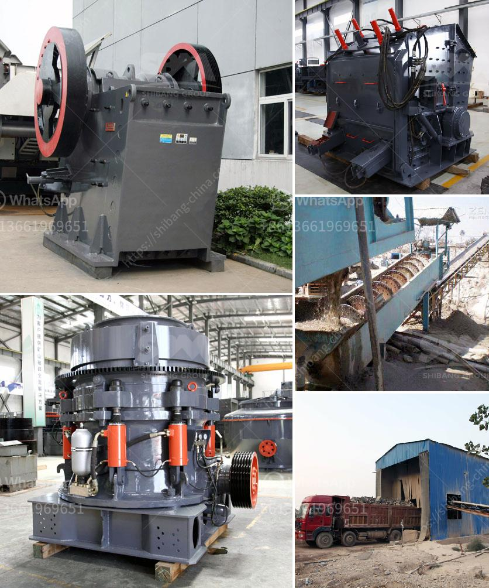

<h3>mobile crushing and screening zimbabwe</h3>
Mobile crushing and screening in Zimbabwe has been growing rapidly due to increasing demand from the construction and mining industries. Lately, the government has been promoting the expansion of these industries in a bid to revitalize the country's economy, and as a result, the demand for mobile crushers and screeners has surged.

Mobile crushing and screening plants are highly flexible and can be easily relocated from one location to another, reducing the need for expensive transportation. These machines are widely used in quarrying activities, mines, road construction, demolition, and recycling applications. They offer various advantages such as reduced downtime, higher efficiency, and cost-effective operation.

One of the leading companies in Zimbabwe that offers these mobile units is ASTRO Crushing and Screening Equipment Ltd. Located in Kwekwe, this innovative company has a wide range of mobile crushers and screens to suit various applications. ASTRO offers both jaw and impact crushers, as well as screens that can be incorporated into the crushing process to separate the desired materials.

In addition to their high-quality machinery, ASTRO also provides comprehensive aftersales support, including maintenance, repairs, and spare parts availability. This ensures that customers can maximize the productivity of their mobile crushing and screening units, leading to efficient operations and higher returns on investment.

The benefits of mobile crushing and screening in Zimbabwe are several. Increased productivity due to reduced downtime, low operational costs, and high-speed operation are some of the primary reasons why they are ideal for Zimbabwe. Also, their ability to deliver high-quality end products with the desired specifications is another advantage.

Mobile crushing and screening has become an essential part of the construction and mining industries in Zimbabwe, as it offers great flexibility and efficiency. If you are interested in these mobile units for your project in Zimbabwe, reach out to ASTRO Crushing and Screening Equipment Ltd., and they will provide you with the right machinery to meet your needs.
<h3>Contact us</h3><ul><li><strong>Whatsapp:&nbsp;<a href="https://wa.me/8613661969651">+8613661969651</a></strong></li><li><a href="https://swt.shibang-china.com/?git&amp;zhl&amp;mobile crushing and screening zimbabwe"><strong>Online Service(chat now)</strong></a></li></ul><h3>Related</h3><ul><li><a href='cheap gravel crusher.md'>cheap gravel crusher</a></li><li><a href='granite crusher machines.md'>granite crusher machines</a></li><li><a href='hammer mill mining.md'>hammer mill mining</a></li><li><a href='raymond grinding machine.md'>raymond grinding machine</a></li><li><a href='cornerstone equipment used rock crushers.md'>cornerstone equipment used rock crushers</a></li></ul>