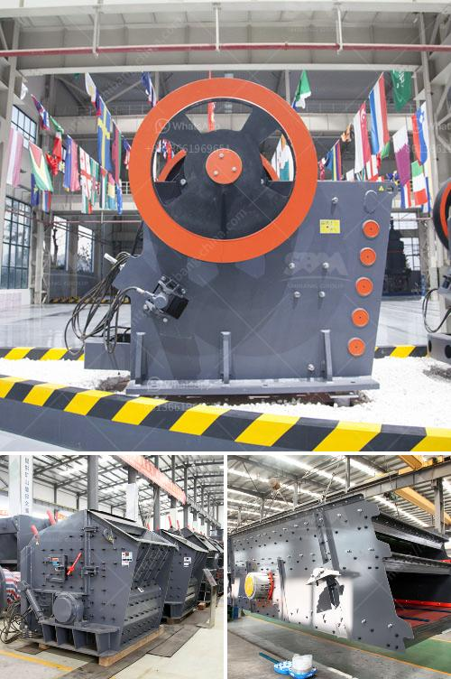

<h3>mobile crushing plant 10x36 cost</h3>
The mobile crushing plant 10x36 cost is a crucial factor in determining whether the crushing plant meets the required production capacity. The high mobility of the crusher plant allows it to move freely and reach various crushing operations. Due to its flexible design, the mobile crushing plant can be customized to fit different crushing applications, making it an ideal choice for construction and mining companies.

The 10x36 mobile crushing plant refers to the portable rock crusher equipment with a capacity of 10-36 tons per hour. It has a jaw crusher, which is responsible for primary crushing. The 10x36 jaw crusher, also known as a tiger mouth, is the main working component of the crushing plant.

When purchasing a mobile crushing plant, the cost is an essential consideration for buyers. The cost of the 10x36 mobile crushing plant can vary depending on the specific model, configuration, and optional features included. Generally, the cost ranges from $100,000 to $300,000.

One of the primary factors influencing the cost of the mobile crushing plant is the quality of its components. High-quality crushers, screens, conveyors, and other equipment tend to be more expensive but offer better durability and efficiency. Investing in high-quality components upfront can reduce maintenance costs and increase the plant's lifespan.

Another factor affecting the cost is the capacity of the mobile crushing plant. A higher capacity plant will typically have a higher cost due to additional production capabilities and larger equipment.  A plant with a larger capacity may be necessary for companies that anticipate a significant increase in their crushing needs in the future.

Additionally, optional features can increase the cost of the 10x36 mobile crushing plant. Some common optional features include a vibrating feeder, magnetic separator, and remote control operation. These features enhance the plant's performance and make it more user-friendly, but they come at an additional cost.

While the initial cost of the mobile crushing plant is essential, it is crucial to consider the long-term cost-effectiveness. A plant with low operating costs, energy-efficient components, and minimal maintenance requirements will ultimately save money in the long run. It is recommended to choose a reliable manufacturer known for durable and efficient equipment.

In conclusion, the mobile crushing plant 10x36 cost is influenced by factors such as the quality of components, capacity requirements, and optional features. It is crucial to consider both the initial cost and long-term cost-effectiveness when investing in a mobile crushing plant. By selecting high-quality components and prioritizing efficiency, companies can optimize their crushing operations and ensure a positive return on investment.
<h3>Contact us</h3><ul><li><strong>Whatsapp:&nbsp;<a href="https://wa.me/8613661969651">+8613661969651</a></strong></li><li><a href="https://swt.shibang-china.com/?git&amp;zhl&amp;mobile crushing plant 10x36 cost"><strong>Online Service(chat now)</strong></a></li></ul><h3>Related</h3><ul><li><a href='river sand processing method.md'>river sand processing method</a></li><li><a href='transmission for ball mill.md'>transmission for ball mill</a></li><li><a href='power calculation hammer mill equation.md'>power calculation hammer mill equation</a></li><li><a href='manganese ore washing plant and crusher in zambia.md'>manganese ore washing plant and crusher in zambia</a></li><li><a href='precipitated calcium carbonate plant.md'>precipitated calcium carbonate plant</a></li></ul>