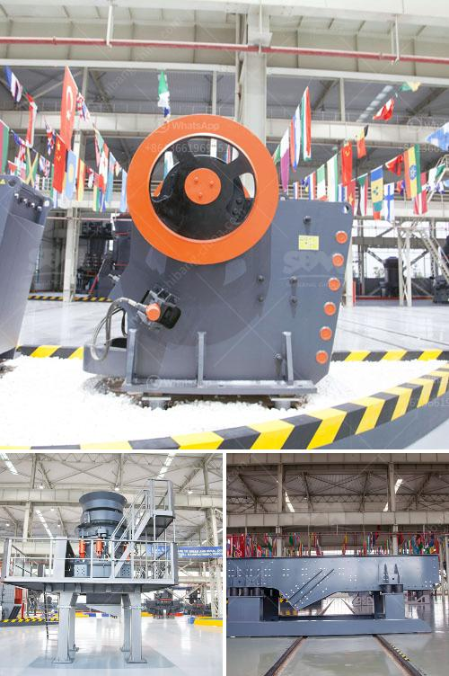

<h3>mobile crushing plant for sale in africa</h3>
Africa is known for its vast mineral wealth and mining activities have played a crucial role in the development of the continent's economy. Africa's mineral resources include gold, diamonds, copper, cobalt, iron ore, coal, and platinum, to name a few. As a result, mining companies from around the world are eager to invest in Africa's mining sector, leading to an increased demand for mobile crushing plants.

Mobile crushing plants are a convenient and flexible way to crush and process various materials, including quarry rock, construction waste, and concrete. They can be used as standalone units or in combination with other crushing and screening plants to create an efficient crushing circuit. With their mobility, they can be easily transported to different sites, allowing miners to take advantage of mineral-rich areas across Africa.

There are several types of mobile crushers available in the market, including jaw crushers, cone crushers, impact crushers, and vertical shaft impactors. Each type has its own advantages and is suitable for specific applications. For example, jaw crushers are commonly used for primary crushing, while cone crushers are ideal for secondary and tertiary crushing. Impact crushers are suitable for applications where the material needs to be reduced in size quickly, and vertical shaft impactors are efficient for producing high-quality cubical aggregates.

One of the major advantages of mobile crushing plants is their cost-effectiveness. Compared to traditional fixed crushing and screening plants, mobile plants require less infrastructure and can be operational in a shorter time frame. This results in lower capital investment and quicker returns on investment. Additionally, mobile plants are highly flexible and can be adjusted to meet changing production requirements. They can be easily relocated to different mining sites, eliminating the need for separate equipment for each location.

In Africa, where infrastructure development is still a challenge in many regions, mobile crushing plants offer a practical solution. They can be easily transported to remote and inaccessible areas, allowing miners to process and transport materials on-site. This eliminates the need for expensive transportation and reduces the environmental impact associated with long-distance haulage. Furthermore, mobile crushing plants can be powered by generators or connected to the local power grid, making them suitable for areas with unreliable electricity supply.

Several manufacturers offer mobile crushing plants for sale in Africa, including Sandvik, Metso, Terex, and Keestrack. These companies also provide after-sales support and spare parts to ensure the smooth operation of the equipment. Buyers can choose from a range of models based on their specific requirements, such as capacity, input size, and output size. Additionally, manufacturers often provide customization options to meet the unique needs of each mining operation.

In conclusion, mobile crushing plants offer a cost-effective and flexible solution for mining operations in Africa. Their mobility and versatility enable miners to exploit mineral-rich areas across the continent, while minimizing infrastructure requirements. With numerous models and options available in the market, buyers can find a mobile crushing plant that suits their needs. Investing in a mobile crushing plant can result in increased productivity, reduced operational costs, and improved environmental sustainability.
<h3>Contact us</h3><ul><li><strong>Whatsapp:&nbsp;<a href="https://wa.me/8613661969651">+8613661969651</a></strong></li><li><a href="https://swt.shibang-china.com/?git&amp;zhl&amp;mobile crushing plant for sale in africa"><strong>Online Service(chat now)</strong></a></li></ul><h3>Related</h3><ul><li><a href='carbon black processing machine in delhi.md'>carbon black processing machine in delhi</a></li><li><a href='jaw rock crusher for sale.md'>jaw rock crusher for sale</a></li><li><a href='hammer mill for sale gumtree.md'>hammer mill for sale gumtree</a></li><li><a href='price of large jaw crusher.md'>price of large jaw crusher</a></li><li><a href='stone crusher machine pakistan.md'>stone crusher machine pakistan</a></li></ul>