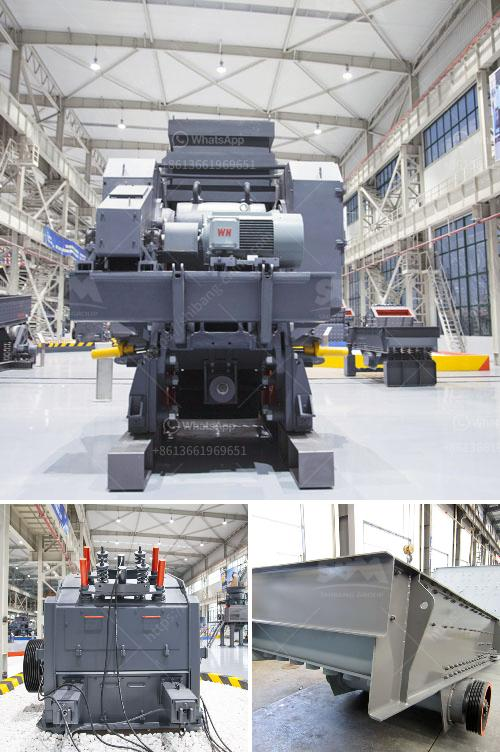

<h3>mobile crushing plant price</h3>
Are you looking for a cost-effective solution to crush and recycle materials on construction sites or mining fields? Look no further than a mobile crushing plant. A mobile crushing plant is a unique machine that includes three stages of crushing. It has been around for many years, but the mobile crushing plant is finally reaching its peak.

With the major increase in demand for mobile crushing machinery due to the impressive benefits that it offers, such as flexibility and high performance, it has become a popular choice in the construction and mining industries. As a result, the mobile crushing plant price has skyrocketed.

So, what influences the mobile crushing plant price? There are several factors to consider when determining the price of a mobile crushing plant.

Firstly, the type and model of the mobile crushing plant. As the crushing plant varies in many aspects, such as type, model, specifications, and size, the price will vary for each different project. There are several mobile crushing plants available in the market, ranging from mini mobile crushers to large stationary crushers. Each type of mobile crushing plant has its own advantages and disadvantages, so it is important to choose the right one for your specific needs.

Secondly, the production capacity of the mobile crushing plant. The higher the production capacity, the higher the price. If your project requires a high volume of materials to be crushed and recycled, you will need a mobile crushing plant with a larger production capacity. However, if your project is small-scale, you can opt for a mobile crushing plant with a lower production capacity to reduce costs.

Thirdly, the manufacturing brand or company. Different brands or companies have different pricing policies and quality standards. It is important to do thorough research on various brands and companies before making a purchase. Look for well-established and reputable manufacturers to ensure that you are investing in a reliable and high-quality mobile crushing plant.

Lastly, the cost of transportation and installation. Mobile crushing plants need to be transported from the manufacturing facility to the project site. The distance and transportation method will influence the overall cost. Additionally, the cost of installation should be considered, as it may require professional assistance.

In summary, the price of a mobile crushing plant depends on several factors, including the type and model of the plant, the production capacity, the manufacturing brand, and the cost of transportation and installation. It is essential to carefully evaluate these factors and choose a mobile crushing plant that fits your specific needs and budget.

With the increasing demand for mobile crushing plants, it is important to ensure that you are investing in a reliable and cost-effective solution. By considering the factors mentioned above, you can find the ideal mobile crushing plant at the right price. A mobile crushing plant will not only save you time and money but also contribute to a more sustainable and environmentally friendly approach to construction and mining activities.
<h3>Contact us</h3><ul><li><strong>Whatsapp:&nbsp;<a href="https://wa.me/8613661969651">+8613661969651</a></strong></li><li><a href="https://swt.shibang-china.com/?git&amp;zhl&amp;mobile crushing plant price"><strong>Online Service(chat now)</strong></a></li></ul><h3>Related</h3><ul><li><a href='mini stone crushing machine.md'>mini stone crushing machine</a></li><li><a href='ballast crusher kenya.md'>ballast crusher kenya</a></li><li><a href='dust control for crushing plants.md'>dust control for crushing plants</a></li><li><a href='cost of stone crusher.md'>cost of stone crusher</a></li><li><a href='how to remove gold dust from sand.md'>how to remove gold dust from sand</a></li></ul>