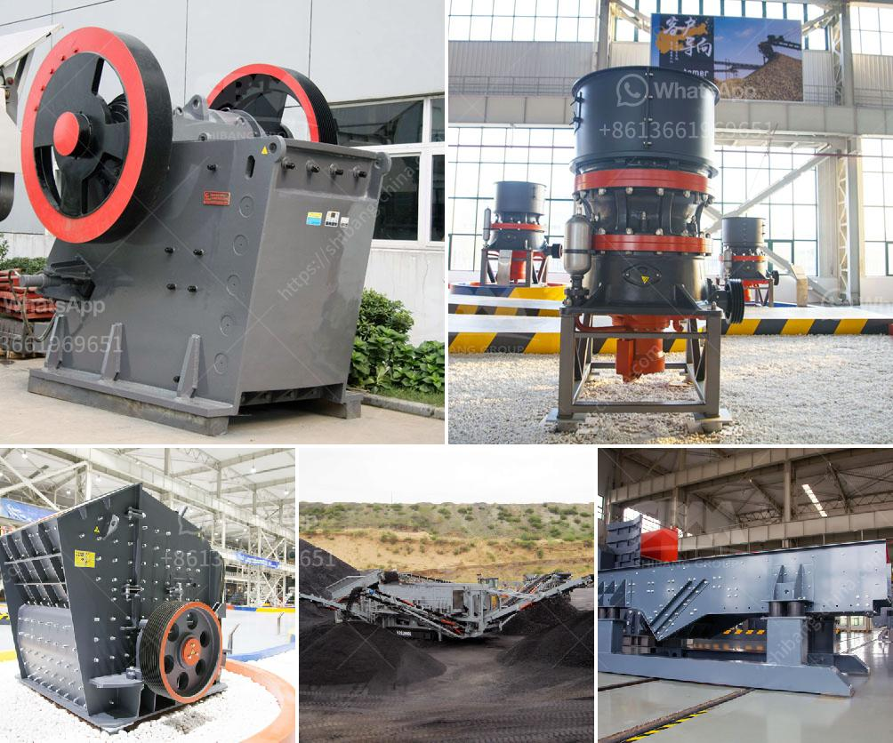

<h3>mobile crushing station</h3>
In recent years, the rapid urbanization of cities has generated an enormous amount of construction waste. The disposal of such waste has posed significant challenges for both the environment and traditional waste management systems. However, with the introduction of mobile crushing stations, this burden is gradually being alleviated.

A mobile crushing station is a self-contained portable unit that is capable of breaking down and processing a variety of materials, such as concrete, stone, and asphalt. These stations are designed to be highly efficient, reliable and flexible in operation, and are able to meet demands for recycling and processing low-grade construction waste.

One of the key features of mobile crushing stations is their mobility. They can be easily moved to different locations, allowing for on-site processing of materials and eliminating the need for transportation to and from a central recycling facility. This not only saves time and costs but also reduces carbon emissions associated with transport.

Moreover, mobile crushing stations are equipped with advanced technologies that enable efficient and environmentally friendly processing of materials. For instance, they can be equipped with dust suppression systems to minimize dust pollution during operation. Additionally, some units are equipped with magnetic separators, which help remove metal contaminants from the processed materials.

Furthermore, mobile crushing stations can greatly contribute to sustainable development by generating valuable resources from construction waste. The processed materials can be recycled and used in various construction projects, such as road base, aggregate, and fill material. This reduces the reliance on natural resources and decreases the need for disposal in landfills.

In conclusion, mobile crushing stations are a revolutionary solution for handling construction waste. They offer flexibility, efficiency, and environmental benefits, making them an indispensable tool for sustainable development. As cities continue to expand, these stations will play a vital role in the responsible management and recycling of construction waste.
<h3>Contact us</h3><ul><li><strong>Whatsapp:&nbsp;<a href="https://wa.me/8613661969651">+8613661969651</a></strong></li><li><a href="https://swt.shibang-china.com/?git&amp;zhl&amp;mobile crushing station"><strong>Online Service(chat now)</strong></a></li></ul><h3>Related</h3><ul><li><a href='limestone tons hour machinery.md'>limestone tons hour machinery</a></li><li><a href='the cost of the stone crusher machine.md'>the cost of the stone crusher machine</a></li><li><a href='vertical cement mill grinding plant.md'>vertical cement mill grinding plant</a></li><li><a href='caco3 carbonate calcium line production.md'>caco3 carbonate calcium line production</a></li><li><a href='tanzania stone crusher machine.md'>tanzania stone crusher machine</a></li></ul>