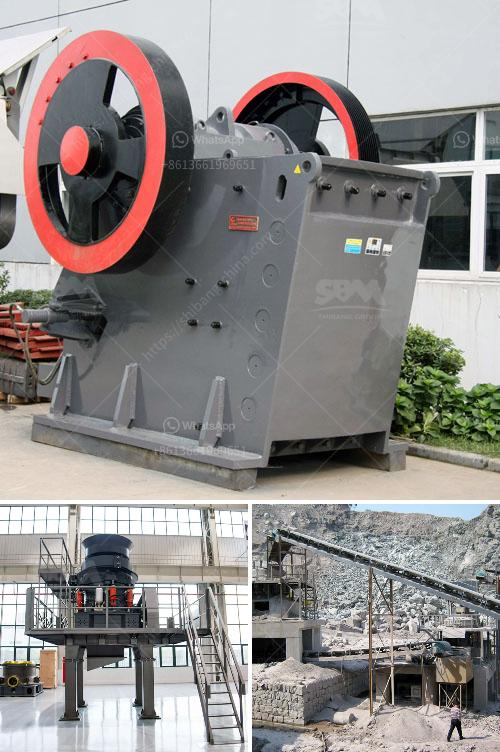

<h3>mobile fine jaw crusher at saudi arabia</h3>
In recent years, the rapid development of infrastructure projects in Saudi Arabia has brought a huge demand for aggregates, especially for stone and sand. The popularity of crushing plants and other mining equipment is soaring in the national market. Therefore, investing in a mobile fine jaw crusher at Saudi Arabia is a wise choice.

The popularity of mobile jaw crushers is driven by the development of construction waste disposal technology. SBM has developed a new generation of mobile jaw crusher after years of research. This mobile fine jaw crusher is very popular among users because of its reliability and convenience.

With the rapid development of infrastructure construction, the rise of the sand industry has also promoted the increasing demand for aggregates. Fine aggregate is an important raw material for concrete production. In the production process of concrete, a large amount of sand is consumed. Whether it is natural sand or artificial sand, it needs to be processed by crushing and screening equipment.

Mobile fine jaw crusher is suitable for aggregate production, construction waste recycling, mining project and other applications. It integrates crushing and screening, which eliminates the obstacles caused by crushing site, environment, and complex basic configuration. This mobile jaw crusher plant can be easily moved to any place at any time, thus making it more convenient for users to adapt to different working conditions.

The mobile jaw crusher adopts hydraulic drive, which saves power and reduces fuel consumption. The design of the equipment is reasonable and compact, which reduces the floor space and installation cost. This mobile jaw crusher is equipped with vibrating feeder, jaw crusher, vibrating screen, and belt conveyor. It is a complete ore production line.

This mobile fine jaw crusher is very cost-effective, with fast and convenient installation, low investment, and excellent performance. The final products are well-graded and of good shape, which meets the requirements of high-speed and high-level roads. It can be used for construction waste recycling, urban infrastructure, building materials and other industries.

The mobile fine jaw crusher is an ideal choice for contractors because of its ruggedness and flexibility, making it a reliable choice for crushing on construction sites. It has excellent mobility and can be easily moved from one location to another, which helps to save transportation costs. Additionally, this mobile jaw crusher is also equipped with dust removal devices, which can effectively solve the dust pollution problems during the operation process.

In conclusion, investing in a mobile fine jaw crusher at Saudi Arabia is a good choice for aggregates production, construction waste recycling, and mining applications. It provides high efficiency and low-cost crushing operation. For more information about SBM mobile jaw crushers for sale, please contact our 24hour online customer service or leave us messages below.
<h3>Contact us</h3><ul><li><strong>Whatsapp:&nbsp;<a href="https://wa.me/8613661969651">+8613661969651</a></strong></li><li><a href="https://swt.shibang-china.com/?git&amp;zhl&amp;mobile fine jaw crusher at saudi arabia"><strong>Online Service(chat now)</strong></a></li></ul><h3>Related</h3><ul><li><a href='stone crusher machine manufacturer in india.md'>stone crusher machine manufacturer in india</a></li><li><a href='limestone manufacturer supplier egypt.md'>limestone manufacturer supplier egypt</a></li><li><a href='coal mining machines in south africa.md'>coal mining machines in south africa</a></li><li><a href='nigeria stone grinder mill.md'>nigeria stone grinder mill</a></li><li><a href='7 in x 8 in hammer mill gold quarz.md'>7 in x 8 in hammer mill gold quarz</a></li></ul>