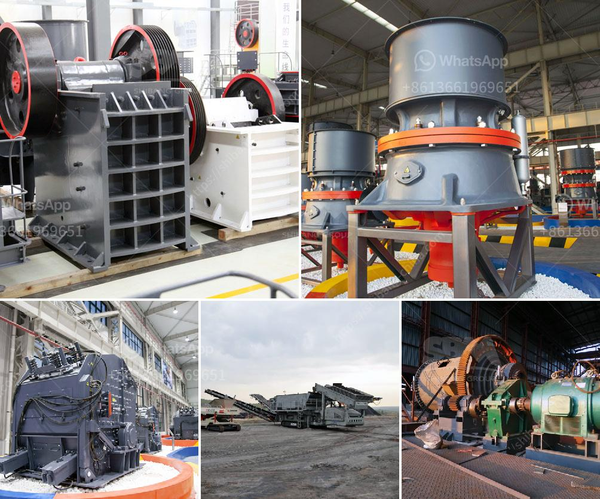

<h3>mobile gold processing plant 1 2 tph</h3>
The importance of mining cannot be underestimated as it plays a critical role in the economic development of a country. However, small-scale mining operations often face many challenges, including limited access to capital, lack of modern equipment, and inadequate processing techniques. As a result, the potential for gold recovery remains largely untapped in many regions.

To address these challenges and support the growth of the small-scale mining sector, mobile gold processing plants have emerged as a cost-effective solution. These plants are compact, portable, and highly efficient, allowing small-scale miners to process gold-bearing ores at their own convenience and in their own territory.

One such mobile gold processing plant is the "MobileMax D" – a compact, portable, and high-capacity plant that can process up to 2 tons of raw material per hour. The plant is specifically designed for the recovery of fine gold particles and has a processing capacity of 1-2 tph (tons per hour).

The key feature of the MobileMax D plant is its mobility, which allows it to be easily transported to remote mining locations. This eliminates the need for expensive infrastructure construction and reduces the cost of transportation. The plant can be set up and operational within a short period of time, enabling small-scale miners to quickly start processing their gold ores.

Another advantage of the MobileMax D plant is its high level of automation and integration of modern processing technologies. The plant is equipped with a gravity concentration module that utilizes centrifugal force to separate gold particles from the raw material. The gold-rich concentrate is then further processed using a combination of shaking tables, sluice boxes, and gold concentrators to ensure maximum gold recovery.

In addition to its processing capabilities, the MobileMax D plant also incorporates an efficient water management system. Water is a crucial resource in the gold processing process, and the plant is designed to minimize its consumption. The water used is recycled and reused within the system, minimizing the environmental impact and providing a sustainable solution for water usage.

Moreover, the MobileMax D plant is designed to be environmentally friendly, with low emissions and minimal disturbance to the surrounding ecosystem. It operates on a diesel-electric hybrid power system, reducing fuel consumption and carbon emissions. The plant also incorporates sound insulation and dust suppression measures to minimize noise and dust pollution.

Overall, the mobile gold processing plant offers small-scale miners a cost-effective and efficient solution for processing gold ores. It provides an alternative to traditional processing methods, which can be expensive, time-consuming, and environmentally damaging. With its compact design, high processing capacity, and mobility, the MobileMax D plant is revolutionizing the small-scale mining industry and unlocking the potential for gold recovery in remote locations. By investing in such innovative technologies, small-scale miners can improve their productivity, profitability, and sustainability, contributing to the growth and development of their local communities.
<h3>Contact us</h3><ul><li><strong>Whatsapp:&nbsp;<a href="https://wa.me/8613661969651">+8613661969651</a></strong></li><li><a href="https://swt.shibang-china.com/?git&amp;zhl&amp;mobile gold processing plant 1 2 tph"><strong>Online Service(chat now)</strong></a></li></ul><h3>Related</h3><ul><li><a href='carbon black pulverizer.md'>carbon black pulverizer</a></li><li><a href='quarry crusher for sale in ghana.md'>quarry crusher for sale in ghana</a></li><li><a href='how to start sand business in nigeria.md'>how to start sand business in nigeria</a></li><li><a href='donesia lowongan kerja kuwait cement plant.md'>donesia lowongan kerja kuwait cement plant</a></li><li><a href='cone crusher factory south africa.md'>cone crusher factory south africa</a></li></ul>