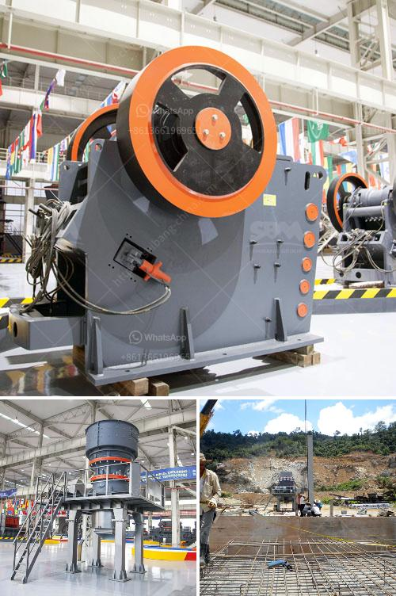

<h3>mobile gold processing plants 1 ton per</h3>
The gold mining industry is experiencing a boom with the ever-increasing demand for gold. With new discoveries and a decline in easily accessible deposits, companies are turning to mobile gold processing plants to increase their output. These plants have revolutionized gold processing by enabling miners to process more gold ore at a reduced cost.

Mobile gold processing plants, also known as mobile trommel units, are built to high industrial standards and can withstand the harshest environments. These units are mounted on a trailer, allowing quick and easy transportation between mining sites. Their versatility and mobility make them an ideal choice for remote and small-scale mining operations.

One of the key advantages of mobile gold processing plants is their ability to process gold ore directly on-site. This eliminates the need for costly transportation of ore to a central processing facility, reducing operational costs and increasing efficiency. These plants can process up to one ton of ore per hour, making them highly productive and profitable.

In addition to their processing capabilities, mobile gold processing plants are designed to be environmentally friendly. They are equipped with advanced technology, such as gravity concentrators and carbon-in-leach systems, which minimize the use of harmful chemicals and reduce the environmental impact of gold processing.

Another significant advantage of mobile gold processing plants is their ability to recover fine gold particles that are often lost in traditional processing methods. These plants are equipped with advanced recovery systems that capture even the smallest gold particles, maximizing the overall gold recovery rate.

With the ability to process one ton of ore per hour, mobile gold processing plants have become a game-changer in the mining industry. They provide a cost-effective solution for small-scale and remote mining operations, enabling miners to process more gold ore and generate higher profits.

As the demand for gold continues to rise, mobile gold processing plants will play a crucial role in meeting the market's needs. Their mobility, efficiency, and environmental benefits make them an essential tool for miners seeking to increase their gold production and reduce their environmental impact.

In conclusion, mobile gold processing plants have revolutionized the gold mining industry by providing an efficient and environmentally friendly solution for processing gold ore. With their ability to process one ton of ore per hour, these plants have become a game-changer for small-scale and remote mining operations. With the ever-increasing demand for gold, these mobile plants are set to play a pivotal role in meeting global gold production targets while ensuring sustainable mining practices.
<h3>Contact us</h3><ul><li><strong>Whatsapp:&nbsp;<a href="https://wa.me/8613661969651">+8613661969651</a></strong></li><li><a href="https://swt.shibang-china.com/?git&amp;zhl&amp;mobile gold processing plants 1 ton per"><strong>Online Service(chat now)</strong></a></li></ul><h3>Related</h3><ul><li><a href='cone crushers for sale.md'>cone crushers for sale</a></li><li><a href='mobile jaw crusher equipment.md'>mobile jaw crusher equipment</a></li><li><a href='jaw crusher design.md'>jaw crusher design</a></li><li><a href='river sand suppliers in northern cape.md'>river sand suppliers in northern cape</a></li><li><a href='harga sewa beli stone crusher kapasitas 30 ton per jam.md'>harga sewa beli stone crusher kapasitas 30 ton per jam</a></li></ul>