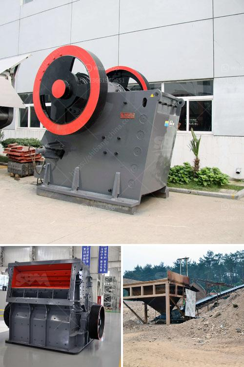

<h3>mobile jaw crusher equipment</h3>
Mobile jaw crusher equipment is a kind of mobile rock crushing and screening equipment specifically designed for the efficient processing of construction waste, mining and industrial minerals. It is often used as primary crusher in aggregate production lines, giving the first step to the efficient reduction of waste materials and ensuring high productivity.

The mobile jaw crusher equipment consists of a primary crushing station, which is equipped with a high-performance crushing unit and a vibrating feeder. The unit is driven by an external power source such as an external power supply or a diesel engine. The equipment is designed to provide maximum productivity and efficiency, featuring a powerful jaw crusher that can handle a wide range of materials.

One of the key features of the mobile jaw crusher equipment is its ability to provide precise and efficient crushing. Unlike traditional crushers, the mobile jaw crusher equipment is compact and easy to move, making it ideal for construction waste crushing projects. The equipment can operate on-site and relocate as needed, providing the flexibility and convenience necessary for efficient crushing. Additionally, the equipment can be equipped with a remote control system, allowing for easy operation and monitoring.

Another advantage of the mobile jaw crusher equipment is its high production capacity. With a capable and efficient jaw crusher at its core, the equipment is able to process large quantities of material, providing high output and productivity. This makes the mobile jaw crusher equipment ideal for large scale operations such as mining or construction projects.

The mobile jaw crusher equipment also provides versatility for crushing various different materials. Offering the ability to crush ore, construction waste, and even hard and abrasive rocks and materials, the mobile jaw crusher equipment is perfect for versatile applications.

For example, the machine's processing capabilities allow for the crushing of large quantities of limestone and the asphalt recycling process. These applications can both be completed while remaining at the construction site, which eliminates the need for transportation to a separate crushing facility.

The mobile jaw crusher equipment is also environmentally friendly, featuring low energy consumption, low emissions, and less noise pollution. This makes the machine highly efficient in its operations, reducing operating costs and ensuring plant safety and environmental friendliness.

In conclusion, the mobile jaw crusher equipment is the ideal solution for construction companies and contractors who want to recycle waste materials and increase production. It offers significant advantages over traditional crushers, including the ability to move the machine and operate it remotely, as well as providing high productivity and versatility. With its compact design, low energy consumption, and low emissions, the mobile jaw crusher equipment is an efficient, environmentally friendly solution for any crushing application.
<h3>Contact us</h3><ul><li><strong>Whatsapp:&nbsp;<a href="https://wa.me/8613661969651">+8613661969651</a></strong></li><li><a href="https://swt.shibang-china.com/?git&amp;zhl&amp;mobile jaw crusher equipment"><strong>Online Service(chat now)</strong></a></li></ul><h3>Related</h3><ul><li><a href='second stone crusher for sale philippines.md'>second stone crusher for sale philippines</a></li><li><a href='gypsum mines in orissa india.md'>gypsum mines in orissa india</a></li><li><a href='clinker grinding plant india.md'>clinker grinding plant india</a></li><li><a href='impact crusher dealer.md'>impact crusher dealer</a></li><li><a href='gravel stone crusher plant.md'>gravel stone crusher plant</a></li></ul>