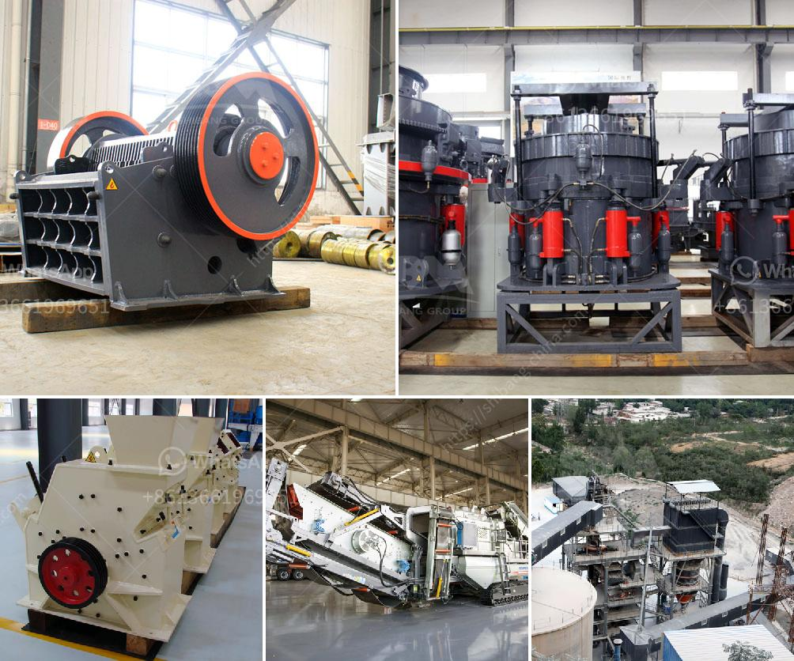

<h3>mobile jaw crusher plant</h3>
The mobile jaw crusher is a valuable piece of equipment for any construction or mining business. This versatile machine can be continually deployed all over the world in the harshest environments, ensuring that you can process materials efficiently and quietly.

The Lokotrack® LT series mobile crushing plant is equipped with a powerful, Nordberg® C120™ jaw crusher that delivers outstanding performance. It utilizes a modern technology to ensure productive and efficient crushing performance. It can process up to 600 tons of material per hour, making it suitable for both small and large-scale operations.

One of the key features of the mobile jaw crusher plant is its ability to produce material of excellent shape. The hydraulic-controlled jaw crusher ensures efficient and smooth operation, providing high productivity and low energy consumption. With its compact design and ease of mobility, the mobile jaw crusher is ideal for operations on limited space.

The mobile jaw crusher plant is built on proven performance and reliability, ensuring it is productive and efficient. The robust C120 jaw crusher provides ongoing, high crushing performance, with excellent durability. This allows for enhanced productivity and efficiency in mining and quarrying applications, as well as recycling and demolition across industries.

The mobile jaw crusher plant is designed with a sturdy arrangement of jaw crusher and a comprehensive screening system, resulting in a high production portable crushing machine. It is equipped with a series of jaw crushers with different specifications. Users can choose according to different production requirements, shape requirements, and particle sizes of finished products. This flexibility allows for more precise material selection and optimization.

In addition to flexibility and productivity, the mobile jaw crusher plant offers users easy maintenance and serviceability. The breakdown and maintenance of traditional jaw crushers can take several hours or even days to complete. However, the mobile jaw crusher plant is engineered to operate simply and effortlessly. The maintenance of the machine is hassle-free, reducing downtime and increasing productivity.

The advanced technology utilized in the mobile jaw crusher plant ensures improved fuel efficiency and reduced emissions. It utilizes a diesel engine that meets all current emission standards, making it a clean and environmentally friendly machine. This is particularly important in strict regulatory environments, where emissions control is a priority.

Furthermore, the mobile jaw crusher plant can be adapted to suit specific customer requirements. It can be customized to meet different crushing applications, such as aggregate production, construction waste recycling, and ore beneficiation. This flexibility provides users with greater control over their operations, allowing for efficient and cost-effective crushing.

In conclusion, the mobile jaw crusher plant is a valuable addition to any mining and construction operation. It enables efficient and reliable crushing performance, offering high productivity and low energy consumption. With a compact design, easy mobility, and customized options, the mobile jaw crusher plant is a versatile and durable machine suitable for a variety of applications.
<h3>Contact us</h3><ul><li><strong>Whatsapp:&nbsp;<a href="https://wa.me/8613661969651">+8613661969651</a></strong></li><li><a href="https://swt.shibang-china.com/?git&amp;zhl&amp;mobile jaw crusher plant"><strong>Online Service(chat now)</strong></a></li></ul><h3>Related</h3><ul><li><a href='process of preparation of coal and asha.md'>process of preparation of coal and asha</a></li><li><a href='gold mining machine from germany.md'>gold mining machine from germany</a></li><li><a href='gold crusher machine.md'>gold crusher machine</a></li><li><a href='komatsu br 380 crusher for sale in malaysia.md'>komatsu br 380 crusher for sale in malaysia</a></li><li><a href='ball mills for rent.md'>ball mills for rent</a></li></ul>