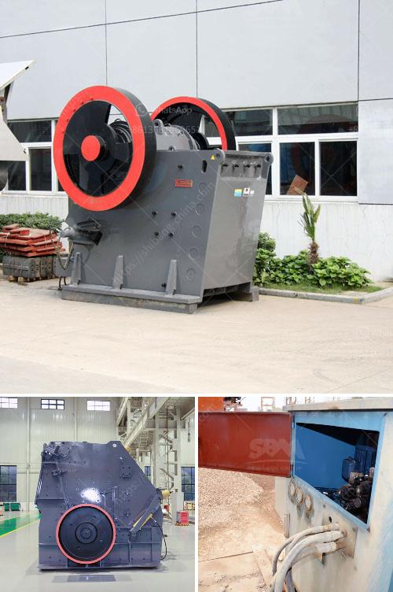

<h3>mobile jaw crusher price</h3>
Mobile jaw crushers are popular models in the market due to their versatility and flexibility. They can be utilized for a variety of tasks, including heavy-duty mining applications, demolition, recycling projects, and contract crushing. With their compact design and easy maneuverability, mobile jaw crushers are an ideal choice for operations where space is limited or transportation requirements are essential. If you are in the market for a mobile jaw crusher, understanding the price range and factors influencing it is crucial. 

The price of a mobile jaw crusher varies greatly depending on the size, configuration, and features selected. The most basic models typically range from $80,000 to $150,000. Larger and more advanced models can cost upwards of $600,000. It is important to note that the price also depends on additional equipment and accessories included, such as hydraulic hammers or screening attachments.

One of the key factors influencing the price of a mobile jaw crusher is its capacity. Higher capacity crushers typically come with a higher price tag. The capacity refers to the maximum amount of material the crusher can process in an hour. It is crucial to select a model that meets your specific needs and production requirements.

Another significant factor affecting the price of mobile jaw crushers is the features and technology they offer. More advanced crushers with innovative features will typically have a higher price. These features may include hydraulic adjustment systems, automatic tramp release, remote control operation, and telematics capabilities. These advanced features enhance the overall performance, efficiency, and ease of operation, which can justify the higher cost for some buyers.

Additionally, the brand reputation and the dealer you choose to purchase the mobile jaw crusher from can influence the price. Well-established brands with a strong track record in the industry may come with a higher price, but they offer reliable and high-quality equipment. Choosing a reputable dealer is also crucial as they can provide expert advice, reliable after-sales support, and potentially better warranty terms.

Comparing prices from different sources and considering various models is essential before making a final decision. It is advisable to get quotes from different dealers and manufacturers to ensure you get the best value for your investment. However, it is equally important to consider the overall quality, durability, and long-term benefits of the equipment rather than solely focusing on the price.

In conclusion, the price of a mobile jaw crusher varies based on factors such as capacity, features, brand reputation, and the dealer you choose. It is crucial to evaluate your specific needs and production requirements before selecting a model. Consider getting multiple quotes to ensure you get the best value for your investment. Ultimately, investing in a high-quality mobile jaw crusher will provide long-term benefits and productivity for your operations.
<h3>Contact us</h3><ul><li><strong>Whatsapp:&nbsp;<a href="https://wa.me/8613661969651">+8613661969651</a></strong></li><li><a href="https://swt.shibang-china.com/?git&amp;zhl&amp;mobile jaw crusher price"><strong>Online Service(chat now)</strong></a></li></ul><h3>Related</h3><ul><li><a href='sell old stone crusher.md'>sell old stone crusher</a></li><li><a href='vsi crusher manufacturer.md'>vsi crusher manufacturer</a></li><li><a href='mobile stone crusher suppliers.md'>mobile stone crusher suppliers</a></li><li><a href='aggregate quarries crusher in thailand.md'>aggregate quarries crusher in thailand</a></li><li><a href='gold processing machinery in china.md'>gold processing machinery in china</a></li></ul>