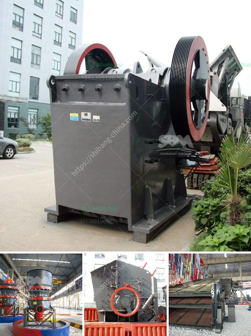

<h3>mobile mining gold equipment</h3>
In the modern era, the mining industry has witnessed remarkable advancements, revolutionizing the way gold is extracted from the Earth's crust. One such innovation that has captivated the industry is mobile mining gold equipment. This cutting-edge technology has not only increased the efficiency of gold extraction processes but has also made mining operations more sustainable and environmentally friendly. With its portability, versatility, and advanced features, mobile mining gold equipment has become a game-changer in the mining sector.

First and foremost, the portability of mobile mining gold equipment has transformed the way mining operations are conducted. Traditional mining methods often require significant infrastructure and machinery, restricting mining activities to specific locations. However, with mobile mining gold equipment, operations can be carried out in any remote or inaccessible location. These mobile platforms are self-contained and can be easily transported from one site to another, eliminating the need for costly infrastructure development. This portability enables mining companies to explore and exploit potential gold mines in previously untapped areas, enhancing the overall productivity and profitability of the industry.

The versatility of mobile mining gold equipment further adds value to its effectiveness. Equipped with state-of-the-art technology and cutting-edge machinery, these mobile units can perform various mining tasks, including exploration, drilling, blasting, and excavation. The integration of multiple functions into a single unit increases operational efficiency, reducing the need for multiple machines and personnel. Additionally, these versatile mobile platforms can adapt to different terrains and mining conditions, making them suitable for both traditional surface mining and unconventional underwater or underground mining. This adaptability broadens the scope of mining opportunities, ensuring optimum resource utilization.

One of the most significant advantages of mobile mining gold equipment is its emphasis on sustainability. Traditional mining methods often have adverse effects on the environment, including deforestation, soil erosion, and water pollution. However, mobile mining equipment incorporates advanced technologies and practices to minimize these environmental impacts. For instance, these mobile units are equipped with advanced filtration systems to prevent soil and water contamination. Additionally, they utilize cleaner and more efficient energy sources, reducing the carbon footprint associated with mining operations. By prioritizing sustainability, mobile mining gold equipment ensures minimal ecological damage while extracting valuable gold resources.

The introduction of mobile mining gold equipment has not only transformed the mining industry but has also opened doors for smaller-scale miners and artisanal miners. With its lower costs and simplified operations, mobile mining equipment provides an opportunity for these marginalized groups to engage in responsible and profitable gold mining. This inclusiveness contributes to the socioeconomic development of local communities, fostering growth and prosperity.

In conclusion, mobile mining gold equipment has emerged as a game-changer in the mining industry. Its portability, versatility, and sustainability have revolutionized the way gold is extracted from the Earth's crust. From remote and inaccessible locations to diversified mining tasks, mobile mining equipment offers a wide range of benefits for mining companies. Moreover, its emphasis on sustainability ensures responsible mining practices, minimizing environmental impacts. With its transformative capabilities, mobile mining gold equipment not only enhances operational efficiency and profitability but also promotes the socio-economic development of communities. As the mining industry continues to evolve, mobile mining gold equipment will remain a vital tool in unlocking the Earth's hidden treasures.
<h3>Contact us</h3><ul><li><strong>Whatsapp:&nbsp;<a href="https://wa.me/8613661969651">+8613661969651</a></strong></li><li><a href="https://swt.shibang-china.com/?git&amp;zhl&amp;mobile mining gold equipment"><strong>Online Service(chat now)</strong></a></li></ul><h3>Related</h3><ul><li><a href='talc grinding plant.md'>talc grinding plant</a></li><li><a href='ton crusher plant price.md'>ton crusher plant price</a></li><li><a href='marble jaw crusher.md'>marble jaw crusher</a></li><li><a href='dolomite plant powder.md'>dolomite plant powder</a></li><li><a href='stone crusher in philippines.md'>stone crusher in philippines</a></li></ul>