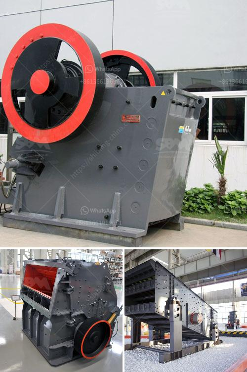

<h3>mobile rock pulverizer grizzly feeder</h3>
A mobile rock pulverizer grizzly feeder is a vital piece of equipment in the mining and construction industries. It is designed to handle heavy-duty materials and efficiently separate them into smaller particles for further processing. This article will explore the features, benefits, and applications of a mobile rock pulverizer grizzly feeder.

A mobile rock pulverizer grizzly feeder is a heavy-duty machine that efficiently breaks down large rocks into smaller particles. It is equipped with grizzly bars, which are parallel metal bars with a series of openings. These bars filter out oversized materials, allowing only the smaller particles to pass through.

One of the main benefits of a mobile rock pulverizer grizzly feeder is its versatility. It can be easily transported from one site to another, making it ideal for applications that require mobility. This feature is particularly useful in the construction industry, where projects often move from one location to another.

Another advantage of a mobile rock pulverizer grizzly feeder is its ability to handle a wide range of materials. It is designed to handle rocks, ores, minerals, and aggregates of various sizes. This makes it an essential tool in mining operations, where large rocks need to be crushed and processed into smaller particles for further extraction.

A mobile rock pulverizer grizzly feeder also offers improved efficiency in material handling. Its robust construction and powerful motor enable it to handle large volumes of material with ease. This reduces the need for manual labor and increases productivity on-site. It also minimizes the risk of downtime or equipment failure, as these feeders are built to withstand heavy-duty applications.

In addition to its primary function of breaking down rocks, a mobile rock pulverizer grizzly feeder can also be used as a scalping screen or a standalone unit. It can efficiently remove fines and oversize particles from the feed material, improving the quality of the final product. This makes it an excellent choice for applications that require precise sizing and separation.

Some mobile rock pulverizer grizzly feeders are equipped with adjustable grizzly bars, allowing operators to customize the size of the openings. This feature is particularly useful in applications where specific particle sizes are required. It provides greater control over the final product and ensures consistent quality throughout the process.

In conclusion, a mobile rock pulverizer grizzly feeder is a versatile and efficient piece of equipment that finds applications in various industries. Its ability to handle heavy-duty materials, its mobility, and its ability to customize particle size make it an essential tool in mining and construction projects. By efficiently separating and processing materials, it improves productivity and ensures the production of high-quality final products.
<h3>Contact us</h3><ul><li><strong>Whatsapp:&nbsp;<a href="https://wa.me/8613661969651">+8613661969651</a></strong></li><li><a href="https://swt.shibang-china.com/?git&amp;zhl&amp;mobile rock pulverizer grizzly feeder"><strong>Online Service(chat now)</strong></a></li></ul><h3>Related</h3><ul><li><a href='stone crushing plant price list.md'>stone crushing plant price list</a></li><li><a href='manufacturer of balls of ball mill in india.md'>manufacturer of balls of ball mill in india</a></li><li><a href='design calculation of jaw crusher pdf.md'>design calculation of jaw crusher pdf</a></li><li><a href='vertical raw mill industry.md'>vertical raw mill industry</a></li><li><a href='cyanide processing plants for sale usa.md'>cyanide processing plants for sale usa</a></li></ul>