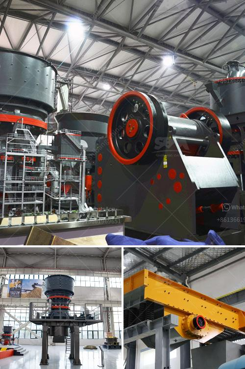

<h3>mobile sand making machine</h3>
The construction industry has witnessed significant advancements over the years, with technology playing a crucial role in enhancing productivity and efficiency. One such innovation that has revolutionized the industry is the mobile sand making machine. As the name suggests, this innovative equipment allows construction companies to produce high-quality sand directly at the construction site, eliminating the need for transportation and reducing overall costs.

Traditionally, sand was sourced from remote locations and transported to construction sites, which incurred hefty transportation costs and delays. Moreover, the quality of sand was often compromised during transportation due to contamination from impurities and dirt. However, with the introduction of mobile sand making machines, construction companies can now produce sand onsite, ensuring consistent quality and a seamless supply.

The mobile sand making machine works through a series of crushing and screening processes, which ensure that coarse particles are broken down and finer particles are separated. The process begins with raw materials being fed into the machine's hopper. The materials are then evenly distributed onto the vibrating feeder, which facilitates a smooth and controlled flow into the jaw crusher.

Once inside the jaw crusher, the materials are crushed to a specific size. The crushed material then passes through a series of screens to separate the different particle sizes. The fine particles are collected and stored as the final sand product, ready for immediate use in construction projects. This entire process is carefully monitored and controlled by the machine's intelligent control system, ensuring high efficiency and minimal wastage.

One of the key advantages of mobile sand making machines is their mobility. These machines are mounted on a portable chassis, allowing them to be easily transported to different construction sites. This eliminates the need for multiple machines at different locations, resulting in significant cost savings for construction companies. Moreover, the compact size of these machines makes them suitable for both small and large-scale construction projects.

Another notable feature of mobile sand making machines is their eco-friendliness. The machines are powered by diesel engines or electricity, both of which are cleaner and more sustainable compared to traditional sand extraction methods. Additionally, these machines have minimal noise and dust emissions, ensuring a healthier and safer working environment for construction workers.

The introduction of mobile sand making machines has also had a positive impact on the quality of construction projects. By producing sand onsite, construction companies have better control over the quality of the materials used in their projects. This leads to enhanced durability and structural integrity of buildings, bridges, and other infrastructure.

In conclusion, the mobile sand making machine has emerged as a game-changer in the construction industry. Its ability to produce high-quality sand onsite, cost-effectiveness, and eco-friendliness have made it a preferred choice for construction companies worldwide. With the growing demand for sustainable and efficient construction practices, this innovative equipment is poised to further transform the industry by streamlining operations and improving project outcomes.
<h3>Contact us</h3><ul><li><strong>Whatsapp:&nbsp;<a href="https://wa.me/8613661969651">+8613661969651</a></strong></li><li><a href="https://swt.shibang-china.com/?git&amp;zhl&amp;mobile sand making machine"><strong>Online Service(chat now)</strong></a></li></ul><h3>Related</h3><ul><li><a href='dry grinding rod mill.md'>dry grinding rod mill</a></li><li><a href='efficiency energetic efficiency of roller mill.md'>efficiency energetic efficiency of roller mill</a></li><li><a href='aggregate concrete plant.md'>aggregate concrete plant</a></li><li><a href='bentonite pulverizer crusher manufacturer.md'>bentonite pulverizer crusher manufacturer</a></li><li><a href='500mm vertical mill stones price.md'>500mm vertical mill stones price</a></li></ul>