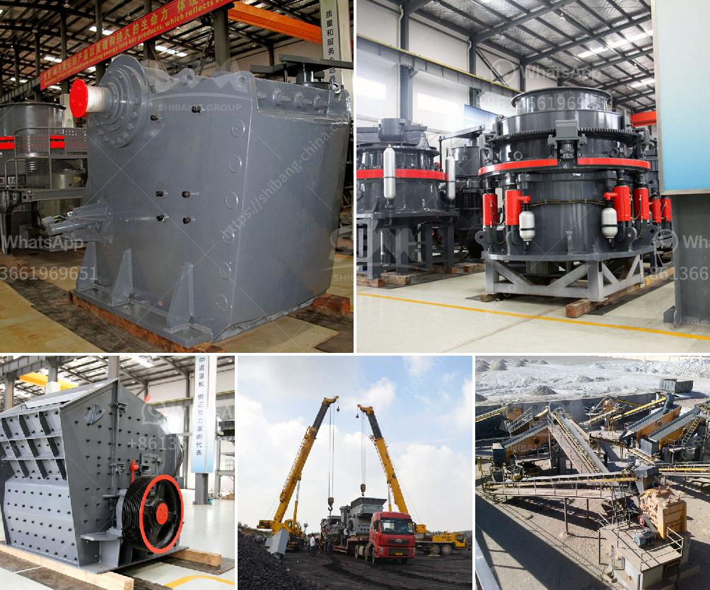

<h3>mobile stone crusher price canada</h3>
The mobile crushing plant is not limited by the crushing place, and reduces high material transportation cost. It can crush materials on site or nearby the raw material, and mobile stone crusher is widely used in the fields of mining, metallurgy, building material, highway, railway, water conservancy and chemical industry.

With the expanding of Canada’s infrastructure construction, there is a growing demand for mobile stone crushers in various regions of Canada. Similar to the rest of the world, the mobile stone crushing plant in Canada has been thriving for its reliable construction, high productivity and easy operation.

The mobile stone crusher price in Canada varies with the machine capacity. With 100-300 tph of capacity, the mobile stone crushers are certainly the most productive and cost-effective jaw crushers for small and medium scale operators. The stone crushers are capable of crushing capacity ranging from 100 TPH to 200 TPH.

The crushers can take feed sizes up to 500mm (one of the largest in the industry) and crush it down to a desired size depending on the requirement. The adjustable jaw setting can be tailored to the needs of the specific application, thus maximizing productivity and efficiency.

One of the factors that affect the price of the mobile stone crusher in Canada is the optimization of the crushing process. In order to save the cost of the whole production line, customers can adjust the settings of the mobile crusher according to their own needs and save the operation cost to a great extent.

Another aspect that influences the price of the stone crusher in Canada is the capacity. Generally speaking, the larger the capacity is, the higher the price will be. The third factor that affects the price is the brand. The companies that provide mobile stone crushers in Canada have a strong technical force, advanced technology, and various types of equipment, which drives the price of the equipment to be higher.

In conclusion, the mobile stone crushing plant price in Canada is determined by the equipment combined with different factors, such as feeding size, capacity, brand and so on. If you are interested in the mobile stone crusher price or have any questions, please feel free to contact us at any time.
<h3>Contact us</h3><ul><li><strong>Whatsapp:&nbsp;<a href="https://wa.me/8613661969651">+8613661969651</a></strong></li><li><a href="https://swt.shibang-china.com/?git&amp;zhl&amp;mobile stone crusher price canada"><strong>Online Service(chat now)</strong></a></li></ul><h3>Related</h3><ul><li><a href='alluvial mining wash plant in canada.md'>alluvial mining wash plant in canada</a></li><li><a href='mobile crushing plant price.md'>mobile crushing plant price</a></li><li><a href='ball mill bekas surabayajn.md'>ball mill bekas surabayajn</a></li><li><a href='types of stone crusher and prices.md'>types of stone crusher and prices</a></li><li><a href='coal crusher equipment.md'>coal crusher equipment</a></li></ul>