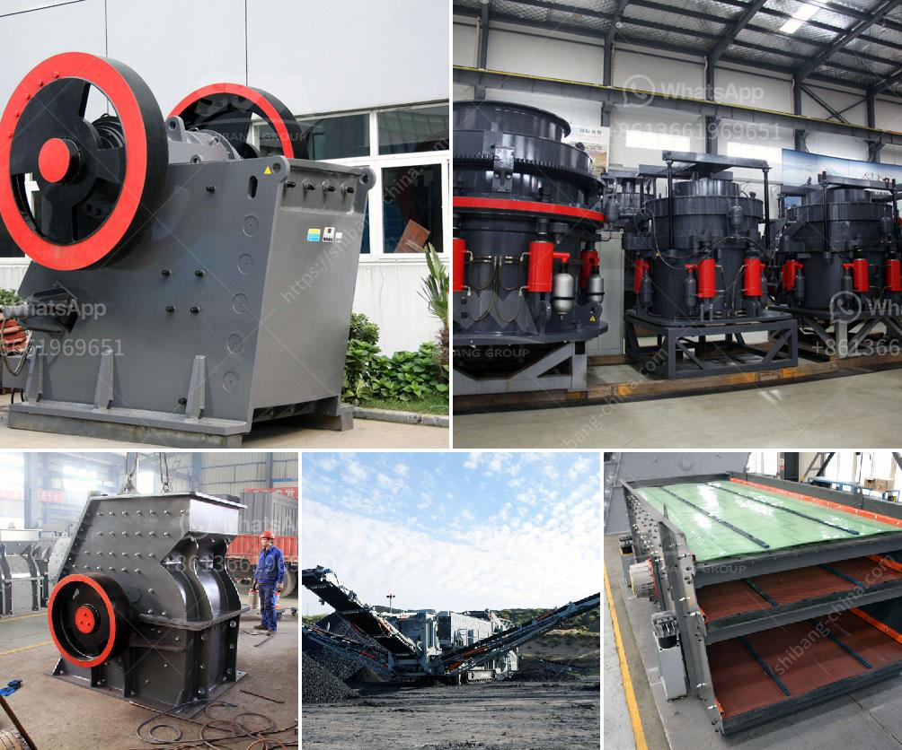

<h3>mobile stone crusher price ph</h3>
With the rapid development of the mining industry, it is undeniable that mobile stone crusher plants are becoming more and more popular nowadays. It is no surprise that the demand for mobile crushers is increasing rapidly, especially in the Philippines, where mining is one of the major industries. As a result, the mobile stone crusher price PH has become a hot topic among the mining community.

One of the factors influencing the mobile stone crusher price PH is the specifications of the crusher. Different types and sizes of crushers have different prices. For instance, a jaw crusher has a wider opening compared to a cone crusher, which allows for larger materials to be processed at a time. Therefore, the price of a jaw crusher is relatively higher than the price of a cone crusher.

Another significant factor affecting the mobile stone crusher price PH is the capacity. A crusher with higher capacity can process more materials at a higher speed. Therefore, it is more efficient and can save more time and energy. Consequently, crushers with higher capacity tend to have a higher price compared to those with lower capacity.

Additionally, the brand and reputation of the crusher manufacturer also play a role in determining the mobile stone crusher price PH. A well-known and reputable manufacturer is more likely to produce durable and high-quality crushers. Therefore, their crushers usually come with a higher price tag compared to lesser-known brands. However, investing in a reliable and reputable brand can guarantee the longevity and reliability of the crusher, making it a wise investment in the long run.

Moreover, the after-sales service provided by the crusher manufacturer can also affect the mobile stone crusher price PH. A manufacturer that offers excellent after-sales service, such as technical support, installation, and maintenance services, may charge a slightly higher price for their products. However, the additional services provided by the manufacturer can greatly benefit the customers, as they can ensure the smooth operation and maintenance of the crusher.

In conclusion, when considering the mobile stone crusher price PH, different factors need to be taken into account. The specifications, capacity, brand, and after-sales service all contribute to the final price of the crusher. It is crucial for buyers to weigh their options carefully and choose a crusher that meets their specific requirements and budget. By doing so, they can ensure that they are making a wise investment that will benefit their mining operations in the long term.
<h3>Contact us</h3><ul><li><strong>Whatsapp:&nbsp;<a href="https://wa.me/8613661969651">+8613661969651</a></strong></li><li><a href="https://swt.shibang-china.com/?git&amp;zhl&amp;mobile stone crusher price ph"><strong>Online Service(chat now)</strong></a></li></ul><h3>Related</h3><ul><li><a href='singapore mining conveyor belt supplier.md'>singapore mining conveyor belt supplier</a></li><li><a href='project cost estimation for iron ore pellet plant.md'>project cost estimation for iron ore pellet plant</a></li><li><a href='ton crushing machine.md'>ton crushing machine</a></li><li><a href='bentonite pulverizer crusher manufacturer.md'>bentonite pulverizer crusher manufacturer</a></li><li><a href='feldspar mining process.md'>feldspar mining process</a></li></ul>