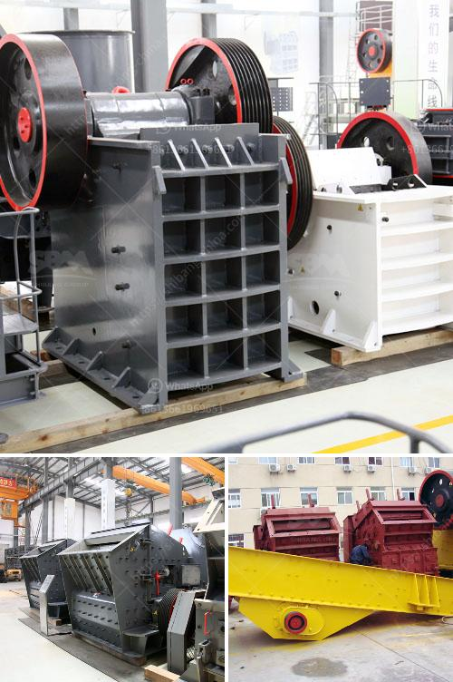

<h3>mobile stone crusher suppliers</h3>
Mobile stone crusher suppliers accommodate small and large scale operations. These suppliers provide a wide range of stone crushers, such as jaw crushers, impact crushers, and cone crushers. They also supply a variety of screening equipment like vibrating screens and feeders. These suppliers have a strong focus on mobility, making their stone crushers convenient to transport and move on-site.

Mobile stone crusher suppliers offer numerous benefits. Firstly, they enable cost-effective stone crushing operations, as they require less infrastructure and transportation costs compared to stationary stone crushers. They can be easily set up and dismantled, allowing businesses to quickly move from one job site to another. This flexibility also increases productivity, as crushers can be relocated closer to the material source, reducing the distance the material needs to be transported.

Additionally, mobile stone crushers are equipped with advanced technology that improves efficiency, reduces downtime, and enhances safety. Many of these crushers feature automation systems that regulate the feed rate, optimize crusher settings, and monitor operational parameters. This automation improves productivity by ensuring that the crusher operates at its optimum capacity.

International mobile stone crusher suppliers have a presence in various countries and are recognized for their reliable equipment. Brands such as Sandvik, Metso, and Terex are well-known for their high-quality crushers and exceptional after-sales service. These suppliers offer a wide range of models suitable for various applications, from mining and construction to recycling and demolition. They have a global network of dealers and distributors, ensuring that customers receive prompt assistance and support.

In addition to international suppliers, local mobile stone crusher suppliers are gaining popularity. These suppliers cater to the specific requirements and preferences of customers in their respective regions. Local suppliers often offer competitive prices, and their close proximity to customers allows for faster delivery of spare parts and technical support. They also contribute to the local economy by creating jobs and boosting the supply chain.

When selecting a mobile stone crusher supplier, it is essential to consider factors such as the supplier's reputation, product quality, after-sales service, and pricing. Customers should also evaluate the supplier's ability to provide customized solutions and meet specific project requirements. Conducting thorough research, reading customer reviews, and seeking recommendations from industry professionals can help businesses make an informed decision.

As businesses strive to increase efficiency and productivity in stone crushing operations, mobile stone crusher suppliers play a crucial role. Their wide range of crushers, advanced technology, and focus on mobility provide businesses with the tools they need to succeed. Whether it's a global brand or a local supplier, the mobile stone crusher industry offers a wide range of options to suit diverse needs.
<h3>Contact us</h3><ul><li><strong>Whatsapp:&nbsp;<a href="https://wa.me/8613661969651">+8613661969651</a></strong></li><li><a href="https://swt.shibang-china.com/?git&amp;zhl&amp;mobile stone crusher suppliers"><strong>Online Service(chat now)</strong></a></li></ul><h3>Related</h3><ul><li><a href='coal washing equipment.md'>coal washing equipment</a></li><li><a href='impact crusher 500tph spcfication.md'>impact crusher 500tph spcfication</a></li><li><a href='rock quarry crusher equipment.md'>rock quarry crusher equipment</a></li><li><a href='quarry plant all in one gold mining equipment.md'>quarry plant all in one gold mining equipment</a></li><li><a href='granite crusher machines.md'>granite crusher machines</a></li></ul>