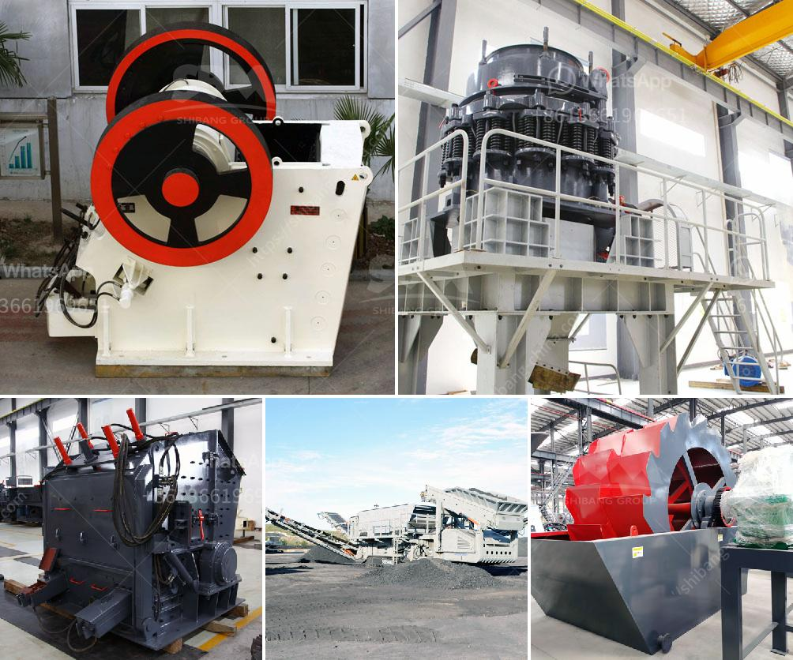

<h3>mobile stone crushing machine</h3>
Mobile stone crushing machines are used to reduce the size of rocks and stones in various construction applications. They are primarily used to facilitate the processing of raw materials, such as ore, cement, and concrete, into smaller pieces. These machines can be transported conveniently and are easy to use, making them an essential tool for any construction project.

One of the major advantages of using mobile stone crushing machines is their flexibility. With their compact design, these machines can be easily moved from one site to another, allowing for greater versatility and efficiency. This is especially useful in areas where raw materials need to be processed in different locations. Contractors can easily transport the machine to the required site, thereby saving time and reducing transportation costs.

Another significant advantage of mobile stone crushing machines is their ability to crush rocks and stones of different sizes. These machines come in various models and are equipped to crush stones as small as a few centimeters and as large as several meters in diameter. This feature makes them suitable for a wide range of construction projects, from road construction to building construction.

Furthermore, mobile stone crushing machines are equipped with powerful engines. These engines enable the machines to crush rocks and stones with ease, ensuring a consistent and efficient crushing process. Additionally, the engines are designed to consume less fuel, making them environmentally friendly and cost-effective.

Mobile stone crushing machines are also equipped with reliable screening equipment. This equipment is used to separate and sort crushed stones into different sizes. The screening process ensures that the stones are uniform in size and suitable for their intended use. For example, smaller stones can be used for making concrete, while larger stones may be used for road construction.

In addition to their versatility and efficiency, mobile stone crushing machines also offer several safety features. These machines are equipped with safety guards and emergency stop buttons to prevent accidents and injuries. Additionally, they are designed with soundproofing materials to minimize noise pollution.

Mobile stone crushing machines have revolutionized the construction industry. They offer a cost-effective and time-saving solution for crushing rocks and stones on-site. Their compact design, powerful engines, and reliable screening equipment make them an invaluable tool for any construction project. Whether it's road construction, building construction, or mining operations, these machines are capable of crushing rocks and stones of various sizes, ensuring a consistent and efficient crushing process. With their safety features and environmental friendliness, mobile stone crushing machines are the future of construction machinery.
<h3>Contact us</h3><ul><li><strong>Whatsapp:&nbsp;<a href="https://wa.me/8613661969651">+8613661969651</a></strong></li><li><a href="https://swt.shibang-china.com/?git&amp;zhl&amp;mobile stone crushing machine"><strong>Online Service(chat now)</strong></a></li></ul><h3>Related</h3><ul><li><a href='control plan for ball mill manufacturing.md'>control plan for ball mill manufacturing</a></li><li><a href='mica powder machine in pakistan.md'>mica powder machine in pakistan</a></li><li><a href='singapore mining conveyor belt supplier.md'>singapore mining conveyor belt supplier</a></li><li><a href='low productivity jaw crusher.md'>low productivity jaw crusher</a></li><li><a href='mkobo crushing and screen.md'>mkobo crushing and screen</a></li></ul>