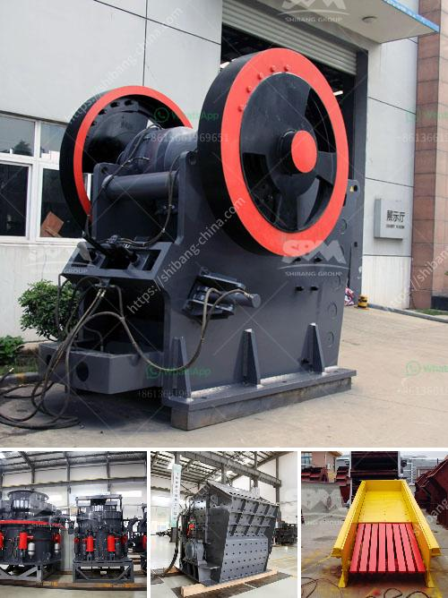

<h3>mobile stone crushing plants price</h3>
Mobile stone crushing plants are a common sight in quarries and mines. They are efficient, rugged, and can handle a wide variety of materials. With the increasing popularity of mobile stone crushers, the demand for these machines is on the rise.

One of the main advantages of a mobile stone crushing plant is its ability to be moved quickly and easily. This allows operators to quickly set up and dismantle the plant as needed, making it highly flexible and adaptable. This is particularly useful in applications where the stone crushing plant needs to be relocated frequently, such as in road construction projects or in quarries where the stone deposits are scattered.

The price of a mobile stone crushing plant can vary depending on the size and configuration of the plant. For example, the larger the plant, the higher the price tag. A 300-500 TPH stone crushing plant can be a significant investment, but it is one that can reap huge benefits if configured correctly.

In the age of technology, mobile stone crushing plants are an indispensable tool for any contractor. They allow operators to crush materials on-site, eliminating the need for transportation and reducing costs. In addition, mobile stone crushers are environmentally friendly, as they produce less dust and noise than their stationary counterparts.

When considering the price of a mobile stone crushing plant, it is important to factor in the cost of fuel. Fuel consumption is a significant cost for any mobile stone crusher, as it accounts for approximately 50%-70% of the operating costs. Therefore, a machine with high fuel efficiency will have lower operating costs and may justify a higher price tag upfront.

Another factor to consider when pricing a mobile stone crushing plant is the quality and durability of the machine. Investing in a high-quality machine ensures that it will operate reliably and efficiently for many years, reducing the need for costly repairs and downtime. It is essential to choose a reputable manufacturer that offers a warranty on their products, as this demonstrates their confidence in the quality and longevity of their machines.

In conclusion, the price of a mobile stone crushing plant can vary depending on its size, configuration, fuel efficiency, and quality. While these factors may influence the initial cost, it is important to consider the long-term benefits of a mobile stone crushing plant, such as increased productivity, reduced transportation costs, and environmental sustainability. By carefully considering these factors, contractors can make an informed decision about investing in a mobile stone crushing plant that meets their needs and budget.
<h3>Contact us</h3><ul><li><strong>Whatsapp:&nbsp;<a href="https://wa.me/8613661969651">+8613661969651</a></strong></li><li><a href="https://swt.shibang-china.com/?git&amp;zhl&amp;mobile stone crushing plants price"><strong>Online Service(chat now)</strong></a></li></ul><h3>Related</h3><ul><li><a href='how much capital needed to start a midium cement factory.md'>how much capital needed to start a midium cement factory</a></li><li><a href='basalt rock crusher suppliers in dubai.md'>basalt rock crusher suppliers in dubai</a></li><li><a href='marble ball mill.md'>marble ball mill</a></li><li><a href='grinding machine manufacturers and suppliers in india.md'>grinding machine manufacturers and suppliers in india</a></li><li><a href='sand sieving machine by vibrating system chennai.md'>sand sieving machine by vibrating system chennai</a></li></ul>