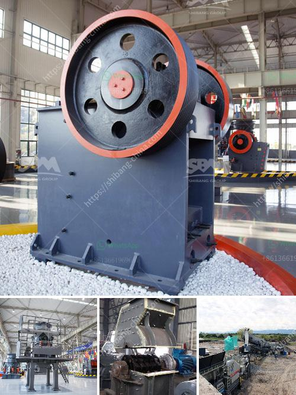

<h3>msi gold wash plant used</h3>
Gold mining is one of the most lucrative industries in the world. However, it comes with numerous challenges, especially when it comes to extracting and recovering gold. One of the solutions to these challenges is the use of the MSI Gold Wash Plant. This innovative piece of equipment offers gold miners a reliable and efficient way to process large quantities of gold-bearing materials.

The MSI Gold Wash Plant is a versatile piece of machinery designed to effectively recover gold as small as 30 mesh, and even smaller. It ensures the highest recovery rate possible, while maintaining a compact footprint. This means that gold miners can achieve excellent results even in tighter spaces, allowing for more efficient use of land and resources.

One of the key features of the MSI Gold Wash Plant is its remarkable adaptability. It can be used in various mining scenarios, from placer mining to hard rock applications. Whether you are operating in remote areas or more accessible sites, this plant has the flexibility to meet your specific needs. With its high recovery rates and ability to process a wide range of materials, including clay-based gravels, it has become a trusted choice for gold miners worldwide.

Efficiency is crucial in gold recovery, as it directly impacts profitability. The MSI Gold Wash Plant boasts exceptional efficiency due to its innovative design features. For instance, it utilizes a grizzly feeder that evenly distributes material to the horizontal screens. This ensures a consistent feedrate, preventing bottlenecks and maximizing the plant's capacity. Additionally, the plant features a robust trommel design that efficiently breaks down and washes gold-bearing materials, resulting in higher yields.

Moreover, the MSI Gold Wash Plant is equipped with various recovery mechanisms to capture even the finest gold particles. Its enhanced sluice design ensures excellent gold recovery rates, while the onboard concentrators work to further concentrate gold for maximum efficiency. This plant also incorporates various sizes of centrifugal concentrators, allowing it to adapt to different feed rates and gold particle sizes.

The MSI Gold Wash Plant's ease of operation is another significant advantage. With its user-friendly controls and intuitive design, gold miners can quickly learn to operate and maintain the plant efficiently. Furthermore, the plant comes with extensive documentation, including operation manuals and training videos, ensuring that operators have all the necessary resources at their disposal.

When it comes to gold mining, time is precious. The quicker gold can be recovered, the more profitable the operation becomes. The MSI Gold Wash Plant offers exceptional speed and productivity, allowing miners to process large quantities of material in a relatively short amount of time. This not only increases efficiency but also reduces downtime, contributing to a more efficient and profitable gold mining operation.

In conclusion, the MSI Gold Wash Plant is a game-changer in the gold mining industry. Its impressive adaptability, efficiency, and ease of operation set it apart from traditional gold recovery methods. Whether you are a seasoned miner or just starting in the industry, this equipment is worth considering. With the MSI Gold Wash Plant, gold recovery is made easier, faster, and more profitable, ensuring the success of your mining operation.
<h3>Contact us</h3><ul><li><strong>Whatsapp:&nbsp;<a href="https://wa.me/8613661969651">+8613661969651</a></strong></li><li><a href="https://swt.shibang-china.com/?git&amp;zhl&amp;msi gold wash plant used"><strong>Online Service(chat now)</strong></a></li></ul><h3>Related</h3><ul><li><a href='mining plant for sale harare zimbabwe.md'>mining plant for sale harare zimbabwe</a></li><li><a href='used ball mill for calcium carbonate sell india.md'>used ball mill for calcium carbonate sell india</a></li><li><a href='allis chalmers 54 x 74 gyratory crusher.md'>allis chalmers 54 x 74 gyratory crusher</a></li><li><a href='processing on barite crushing.md'>processing on barite crushing</a></li><li><a href='silica sand crusher in turkey.md'>silica sand crusher in turkey</a></li></ul>