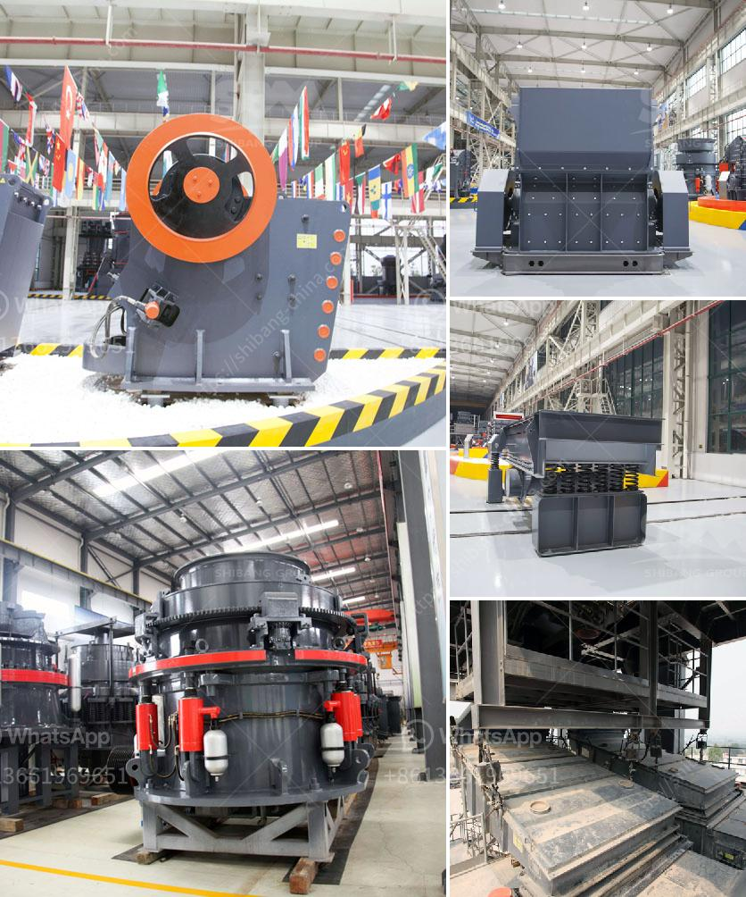

<h3>mtm trapezium grinder mill</h3>
The MTM trapezium grinder mill, also known as the medium speed trapezium mill, is widely used in the metallurgy, building materials, chemical, mining and other industries. It is designed for crushing and grinding all kinds of non-flammable and non-explosive materials with Mohs hardness below 9.3 and humidity less than 6%.

The MTM trapezium grinder mill consists of a main machine, a reducer, an analyzer, a feeder, a separator, a fan, and a dust collector. The materials enter the grinding chamber through the feeding system, and the shovel blade pushes them to the grinding roller and grinding ring, achieving the purpose of grinding. The materials are crushed and ground by the roller, and then brought into the separator through the analysis machine. The qualified fine powder is collected by the cyclone collector, and the coarse particles are returned to the grinding chamber for re-grinding.

One of the key features of the MTM trapezium grinder mill is its high efficiency. The unique design of the roller sleeve and the grinding ring greatly improves the grinding efficiency and increases the fineness of the final product. The spring pressure device ensures that the grinding pressure can be adjusted according to different materials and finished product requirements. The high-density blades on the shovel can effectively increase the production capacity and reduce energy consumption.

Another advantage of the MTM trapezium grinder mill is its stable operation. The main engine adopts airtight gearing and pulley drives, ensuring that the machine runs smoothly and reliably. The base is made of a whole cast steel structure, which enhances the stability of the equipment and extends its service life. The electrical system adopts centralized control, which can realize unmanned operation and improve work efficiency.

In addition, the MTM trapezium grinder mill is also environmental-friendly. The whole system is equipped with a pulse dust collector, which can effectively reduce dust and noise pollution during operation. The advanced production technology and inspection equipment ensure that the machine meets the national environmental protection requirements.

Overall, the MTM trapezium grinder mill is a reliable and efficient grinding equipment for various industries. Its high efficiency, stable operation, and environmental-friendly features make it an ideal choice for crushing and grinding applications. With its advanced technology and excellent performance, the MTM trapezium grinder mill is rapidly gaining popularity in the market and is widely used in various production lines.
<h3>Contact us</h3><ul><li><strong>Whatsapp:&nbsp;<a href="https://wa.me/8613661969651">+8613661969651</a></strong></li><li><a href="https://swt.shibang-china.com/?git&amp;zhl&amp;mtm trapezium grinder mill"><strong>Online Service(chat now)</strong></a></li></ul><h3>Related</h3><ul><li><a href='aggregate quarry crusher philippines.md'>aggregate quarry crusher philippines</a></li><li><a href='second hand sand making machine cost.md'>second hand sand making machine cost</a></li><li><a href='second stone crusher for sale philippines.md'>second stone crusher for sale philippines</a></li><li><a href='quarry plant all in one gold mining equipment.md'>quarry plant all in one gold mining equipment</a></li><li><a href='cost of lime stone crusher plant.md'>cost of lime stone crusher plant</a></li></ul>