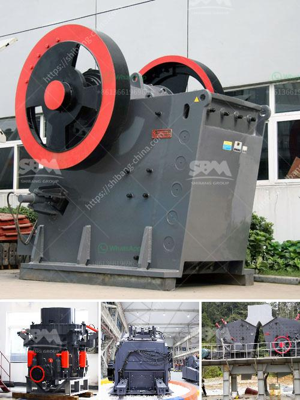

<h3>nepal crushing crusher</h3>
Nepal, a landlocked country nestled in the Himalayas, has been experiencing steady economic growth in recent years. However, amidst this development, concerns about environmental degradation and the sustainability of natural resources have been raised, especially in relation to the crusher industry. This article aims to explore the challenges facing Nepal's Crusher industry and the efforts being made to ensure sustainable development.

The crusher industry in Nepal plays a significant role in the country's infrastructure development, providing essential raw materials for construction. However, in recent years, this industry has come under intense scrutiny due to its adverse impact on the environment. The excessive extraction of sand, stones, and other materials has resulted in deforestation, riverbank erosion, and has disrupted the natural habitats of various wildlife species.

The unregulated extraction of materials by crushers has led to the degradation of Nepal's fragile ecosystems. Riverbed erosion caused by uncontrolled riverbed mining has resulted in landslides and increased vulnerability to natural disasters like floods. Additionally, the dust and noise pollution caused by crushers have negatively affected the health and quality of life for local communities.

One of the primary concerns with Nepal's crusher industry is the absence of strict regulations and guidelines governing their operations. This has allowed crusher operators to operate with little regard for their environmental responsibilities. Without proper oversight, the industry has thrived, leading to indiscriminate and unsustainable extraction practices.

Recognizing the need for sustainable development, the government of Nepal has begun taking measures to address the challenges posed by the crusher industry. Environmental impact assessments are now a requirement before obtaining operating licenses, intending to control and minimize the ecological effects of crusher operations. Furthermore, the government has placed restrictions on crusher operators, mandating that they reclaim and rehabilitate the mined areas after extraction. These steps seek to mitigate the environmental damage caused by the industry.

Alongside governmental initiatives, non-governmental organizations (NGOs) and community-based initiatives are playing a crucial role in advocating for sustainable practices in Nepal's crusher industry. These organizations are engaging with crusher operators, raising awareness about sustainable mining techniques, and emphasizing the importance of environmental conservation. They are actively involved in capacity building, providing training to industry workers on sustainable mining practices, environmental conservation, and health and safety measures.

Nepal's crusher industry, while essential for infrastructure development, needs to find a balance between economic growth and environmental sustainability. The uncontrolled extraction of materials has led to severe environmental degradation, affecting the livelihoods of local communities and the country's natural resources. However, with the government's increasingly stringent regulations and the involvement of NGOs and community initiatives, there is hope for implementing sustainable practices within the industry. As Nepal continues to develop, it is crucial that crusher operators and policymakers prioritize environmental conservation and work towards a more sustainable future.
<h3>Contact us</h3><ul><li><strong>Whatsapp:&nbsp;<a href="https://wa.me/8613661969651">+8613661969651</a></strong></li><li><a href="https://swt.shibang-china.com/?git&amp;zhl&amp;nepal crushing crusher"><strong>Online Service(chat now)</strong></a></li></ul><h3>Related</h3><ul><li><a href='mobile crusher tanzania.md'>mobile crusher tanzania</a></li><li><a href='gravel stone crusher plant.md'>gravel stone crusher plant</a></li><li><a href='quarry equipment for sale brisbane.md'>quarry equipment for sale brisbane</a></li><li><a href='vertical roll mill.md'>vertical roll mill</a></li><li><a href='diamond dms plant for sale south africa.md'>diamond dms plant for sale south africa</a></li></ul>