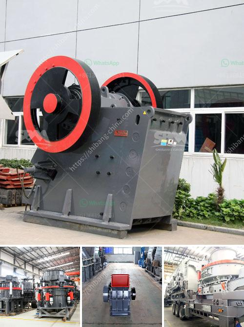

<h3>new crushing machines in oman</h3>
Oman, known for its rich natural resources of oil, gas, and minerals, is making significant strides in harnessing its potential as a hub for various industries. With the introduction of state-of-the-art crushing machines, aimed at boosting productivity and reducing the environmental impact of mining operations, Oman is on the brink of revolutionizing its mining industry.

The new crushing machines, developed by leading manufacturers, incorporate advanced features like hydraulic setting adjustment, tramp release, and automated controls making them user-friendly and yield high productivity. With these advancements, many companies in the mining sector are transitioning to automated crushing systems, which result in faster, more precise crushing operations with minimal downtime.

One of the primary advantages of these new crushing machines is their ability to efficiently process a wide array of materials while minimizing waste generation. By incorporating eco-friendly design principles, these machines significantly reduce dust, noise, and overall environmental impact. Furthermore, their use ensures responsible handling of materials from extraction to processing, aligning with Oman's commitment towards sustainable development.

The introduction of these state-of-the-art crushing machines heralds a new era for mining operations in Oman. The improved efficiency and reduced environmental impact translate into cost savings for companies, facilitating greater profitability and sustainability. This development also positions Oman as a technologically advanced mining hub in the region.

Oman's mining industry is set to soar to new heights with the incorporation of modern crushing machines. Companies are embracing these advanced technologies to unlock their full potential, enabling them to optimize their operations, boost productivity, and contribute to sustainable development principles, positioning Oman as a prominent player in the global mining industry.
<h3>Contact us</h3><ul><li><strong>Whatsapp:&nbsp;<a href="https://wa.me/8613661969651">+8613661969651</a></strong></li><li><a href="https://swt.shibang-china.com/?git&amp;zhl&amp;new crushing machines in oman"><strong>Online Service(chat now)</strong></a></li></ul><h3>Related</h3><ul><li><a href='gold mill equipment zimbabwe.md'>gold mill equipment zimbabwe</a></li><li><a href='dedusting systems for crushers.md'>dedusting systems for crushers</a></li><li><a href='quartz crushing plant german tecnology.md'>quartz crushing plant german tecnology</a></li><li><a href='crusher price sayaji.md'>crusher price sayaji</a></li><li><a href='used 900 cone crusher for sale.md'>used 900 cone crusher for sale</a></li></ul>