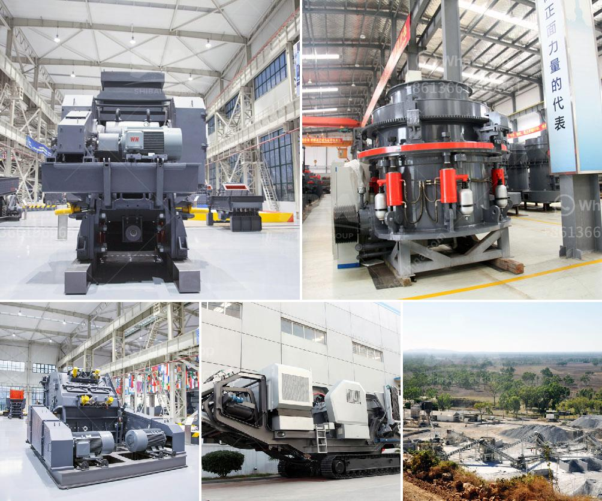

<h3>new gypsum board plant in india</h3>
India's rapid growth in infrastructure sectors such as real estate, commercial spaces, and industrial projects has created a demand for high-quality building materials. One essential material in this regard is gypsum board, which has gained popularity due to its versatility, durability, and ease of installation. In response to this growing demand, a new gypsum board plant has been established in India, aiming to cater to the nation's burgeoning construction industry.

Situated in a strategic location, the new gypsum board plant is based in [Location Name], ensuring convenient access to major transportation routes for nationwide distribution. With a production capacity of [X] metric tons per day, the plant's facility is spread over [X] acres, equipped with advanced technology and machinery to ensure high productivity and optimum utilization of resources.

The plant boasts the latest technological advancements in the manufacturing of gypsum boards, ensuring top-notch product quality. Automated machinery and cutting-edge equipment enable a seamless production process, minimizing human error and ensuring consistently superior products. Additionally, the advanced machinery enables flexibility in manufacturing a wide range of gypsum board types, catering to diverse construction requirements.

The new gypsum board plant in India prioritizes environmental preservation and responsible manufacturing practices. eco-friendly manufacturing principles have been implemented to minimize energy consumption, waste generation, and carbon emissions. The plant adheres to stringent environmental standards, ensuring compliance with regulations and contributing to sustainable development.

The establishment of the gypsum board plant has generated numerous employment opportunities for the local workforce. From engineers to technicians, machine operators to administrative staff, the plant aims to provide meaningful employment for individuals with various skill sets. Additionally, the plant has also created indirect employment opportunities in transportation, logistics, and other related sectors, further boosting the region's economic growth.

One of the plant's key objectives is to maintain the highest standards of quality assurance. Stringent quality control measures have been implemented at every stage of the manufacturing process, from raw material sourcing to final product distribution. The gypsum boards undergo thorough testing to ensure they meet industry standards and customer expectations. By delivering consistent quality, the plant aims to establish itself as a trusted supplier of gypsum boards in the highly competitive market.

The establishment of a new gypsum board plant enhances India's position as a hub for construction materials. As demands for high-quality building materials continue to surge, the plant's contribution towards meeting these needs will significantly impact the construction industry. High-quality gypsum boards will aid in the timely completion of projects while maintaining durability and aesthetic appeal.

The new gypsum board plant in India signifies the nation's commitment to meeting the growing infrastructure demands. With its state-of-the-art technology, eco-friendly practices, and focus on quality, the plant is well-positioned to cater to the construction industry's needs. Alongside generating employment opportunities, the plant's impact on the market is expected to be significant, ensuring the availability of superior gypsum boards for India's growing construction sector.
<h3>Contact us</h3><ul><li><strong>Whatsapp:&nbsp;<a href="https://wa.me/8613661969651">+8613661969651</a></strong></li><li><a href="https://swt.shibang-china.com/?git&amp;zhl&amp;new gypsum board plant in india"><strong>Online Service(chat now)</strong></a></li></ul><h3>Related</h3><ul><li><a href='type of ball mill.md'>type of ball mill</a></li><li><a href='aggregate quarry crusher philippines.md'>aggregate quarry crusher philippines</a></li><li><a href='copper oxide concentrate processing machines.md'>copper oxide concentrate processing machines</a></li><li><a href='gypsum crushing machines.md'>gypsum crushing machines</a></li><li><a href='gypsum powder production line capacity 80 tons per hour.md'>gypsum powder production line capacity 80 tons per hour</a></li></ul>