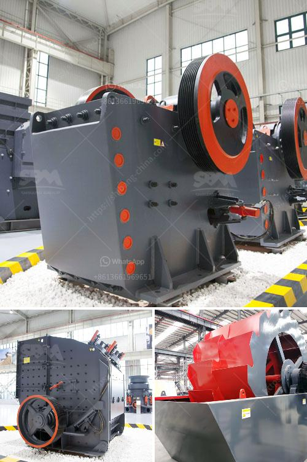

<h3>nigeria ball mill pakistan</h3>
Nigeria and Pakistan are two countries that have made significant contributions to the world of ball milling. Ball milling is a mechanical technique used to grind materials into fine powders used in various industrial sectors such as cement production, paint manufacturing, and mineral processing.

Nigeria, known as the "Giant of Africa," is the most populous country on the continent. It is endowed with abundant natural resources, including solid minerals such as limestone, gold, and tin, which are essential for ball milling. Nigeria has several ball mills used by the mining industry to pulverize raw materials for cement production, ceramics making, and other applications.

One notable ball mill in Nigeria is the Gusu Ball Mill Company, which is a renowned manufacturer of chocolates and confectionery equipment in the country. Other equally notable companies include Zuma Steel West Africa, Pokobros Group, and Topsteel Nigeria Limited, among others. These companies utilize ball mills in their production processes, demonstrating Nigeria's growing expertise in this field.

On the other hand, Pakistan, known as the "Land of the Pure," is a country located in South Asia. With a rich cultural heritage and a diverse industrial sector, Pakistan has also made remarkable contributions to ball milling. Numerous ball mills are employed in sectors such as chemical engineering, ceramics, mineral processing, and paint manufacturing across the country.

Pakistan has established several reputable ball mill manufacturers, such as Dalmia Cement, which produces reliable and high-quality ball mills used in the cement industry. Another prominent company is Kohat Cement, which focuses on producing cement products used in both residential and commercial construction. This demonstrates Pakistan's commitment to leveraging ball milling technology for economic growth and development.

Both Nigeria and Pakistan face similar challenges in the ball milling industry. Infrastructure, electricity availability, and skilled labor are crucial factors for the establishment and smooth operation of ball mills. However, both nations have made progress in overcoming these hurdles, leading to increased efficiency and productivity in their respective ball milling sectors.

Furthermore, Nigeria and Pakistan have recognized the importance of research and development in advancing ball milling technology. Both countries have established research institutions and universities that focus on materials science, engineering, and mining. These institutions conduct extensive research to improve ball milling processes and develop innovative solutions to address industry-specific challenges.

In conclusion, Nigeria and Pakistan have emerged as strong contenders in the field of ball milling. Their robust industrial sectors, access to natural resources, and commitment to research and development have led to the establishment of reputable ball mill manufacturers in both countries. As they continue to invest in infrastructure and skill development, Nigeria and Pakistan are poised to become major players in the global ball milling industry.
<h3>Contact us</h3><ul><li><strong>Whatsapp:&nbsp;<a href="https://wa.me/8613661969651">+8613661969651</a></strong></li><li><a href="https://swt.shibang-china.com/?git&amp;zhl&amp;nigeria ball mill pakistan"><strong>Online Service(chat now)</strong></a></li></ul><h3>Related</h3><ul><li><a href='chinese mining equipment companys.md'>chinese mining equipment companys</a></li><li><a href='list of price of stone crusher machine in zimbabwe.md'>list of price of stone crusher machine in zimbabwe</a></li><li><a href='crusher in sale in nepal.md'>crusher in sale in nepal</a></li><li><a href='buy impact crushers.md'>buy impact crushers</a></li><li><a href='list of quarry crusher company in the philippines.md'>list of quarry crusher company in the philippines</a></li></ul>