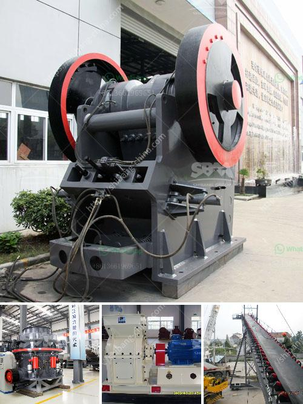

<h3>nigeria minerals crusher processing company</h3>
Nigeria, a country located in West Africa, is known for its abundance in mineral resources. In recent years, the country has seen a surge in the establishment of companies that are focused on mining and processing minerals for various purposes. One such company that has emerged in Nigeria is the Nigeria Minerals Crusher Processing Company.

Nigeria Minerals Crusher Processing Company aims to provide a range of engineering solutions to meet the needs of the mining and mineral processing industries in Nigeria. With their team of experienced engineers and professionals, they offer a variety of services including the custom design, fabrication, and installation of mineral processing plants.

The company specializes in the crushing and processing of various minerals, including limestone, granite, coal, iron ore, and gold ore. By using state-of-the-art technology, Nigeria Minerals Crusher Processing Company ensures that their products are of high quality and meet international standards.

The processing of minerals involves various stages, including crushing, grinding, screening, and separation. Nigeria Minerals Crusher Processing Company utilizes advanced machinery and equipment to carry out these processes efficiently and effectively. Their crushers and mills are designed to reduce the size of the minerals, making them suitable for further processing.

In addition to their processing capabilities, Nigeria Minerals Crusher Processing Company also offers maintenance services to their clients. Regular maintenance is essential for the smooth operation of mineral processing plants and prevents downtime. The company's skilled technicians conduct inspections, repairs, and replacements to ensure that the plants remain in optimal condition.

Overall, Nigeria Minerals Crusher Processing Company plays a crucial role in the mining and mineral processing industry in Nigeria. With their expertise and cutting-edge technology, they contribute to the growth and development of the country's economy. They provide employment opportunities and contribute to the local communities by adhering to environmentally friendly practices.
<h3>Contact us</h3><ul><li><strong>Whatsapp:&nbsp;<a href="https://wa.me/8613661969651">+8613661969651</a></strong></li><li><a href="https://swt.shibang-china.com/?git&amp;zhl&amp;nigeria minerals crusher processing company"><strong>Online Service(chat now)</strong></a></li></ul><h3>Related</h3><ul><li><a href='stone crusher machinery list in india.md'>stone crusher machinery list in india</a></li><li><a href='calcite micronized manufacturing plant pdf.md'>calcite micronized manufacturing plant pdf</a></li><li><a href='impact crusher machine supplier.md'>impact crusher machine supplier</a></li><li><a href='quarry impact crusher equipment.md'>quarry impact crusher equipment</a></li><li><a href='limestone small crusher machine.md'>limestone small crusher machine</a></li></ul>