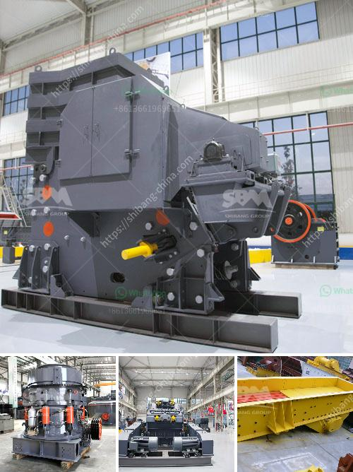

<h3>nigeria mobile crusher</h3>
The mobile crusher has been a game changer for many Nigerian contractors, as it provides efficient and versatile crushing capabilities. Whether you need to crush rocks, stones, or other materials for construction and infrastructure projects, the mobile crusher offers an ideal solution.

One of the biggest advantages of a mobile crusher is its flexibility. It can be easily transported to different locations, allowing contractors to take advantage of various job opportunities. This means that crushing can be done on-site, reducing the need for transporting materials and saving time and money. Additionally, the mobile crusher can be set up quickly, enabling contractors to start crushing operations almost immediately.

Another key benefit of the mobile crusher is its ability to process a wide range of materials. Whether it is concrete, asphalt, or even natural stone, the mobile crusher can effectively crush and recycle these materials, making them reusable for future projects. This not only helps in conserving natural resources but also minimizes waste and contributes to a more sustainable construction industry.

In Nigeria, where road infrastructure is rapidly developing, the mobile crusher provides an efficient solution for contractors working on road construction projects. By crushing the rocks and stones on-site, the mobile crusher eliminates the need for transporting materials from quarries, reducing costs and ensuring a steady supply of crushed materials for road construction.

Furthermore, the mobile crusher offers exceptional productivity and efficiency. With its powerful engine and advanced crushing technology, it can process large quantities of materials in a relatively short time. This allows contractors to meet tight project deadlines and maximize their productivity.

Overall, the mobile crusher has revolutionized the construction industry in Nigeria. Its flexibility, versatility, and efficiency make it a valuable tool for contractors. Whether you are involved in road construction, building construction, or any other project that requires crushing, the mobile crusher can greatly enhance your operations and help you achieve your goals efficiently and successfully.
<h3>Contact us</h3><ul><li><strong>Whatsapp:&nbsp;<a href="https://wa.me/8613661969651">+8613661969651</a></strong></li><li><a href="https://swt.shibang-china.com/?git&amp;zhl&amp;nigeria mobile crusher"><strong>Online Service(chat now)</strong></a></li></ul><h3>Related</h3><ul><li><a href='crushing plants south africa.md'>crushing plants south africa</a></li><li><a href='3 roller mill manufacturers in india.md'>3 roller mill manufacturers in india</a></li><li><a href='talc grinding plant.md'>talc grinding plant</a></li><li><a href='hammer crusher hammer balancing chart.md'>hammer crusher hammer balancing chart</a></li><li><a href='india herzog pulverizer hp m 100 p venta.md'>india herzog pulverizer hp m 100 p venta</a></li></ul>