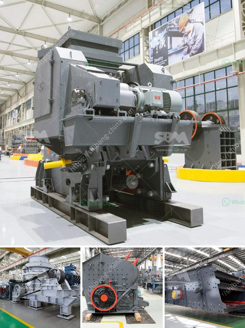

<h3>nigeria stone grinder mill</h3>
The Nigerian market has a growing demand for locally sourced and processed products. As a result, the need for efficient and modern milling machines has become apparent. One such machine that has been gaining popularity among Nigerian farmers and millers is the stone grinder mill.

The stone grinder mill is a high-powered machine with durable grinding stones that effectively grinds grains into flour. This efficient machine can be used to process a wide range of grains such as rice, corn, wheat, and even beans. With its powerful motor and sturdy construction, it can handle large quantities of grains with ease, making it ideal for commercial milling operations.

One of the key benefits of the stone grinder mill is its ability to produce high-quality flour. The grinding stones used in this machine are made of natural materials such as granite or basalt, which are known for their hardness and durability. These stones are carefully selected to ensure that they have the right balance of hardness and grit to create the perfect flour texture.

Unlike modern roller mills that crush the grains, the stone grinder mill uses a traditional method of milling called stone milling. This process involves the grinding stones rotating against each other, crushing the grains and creating friction that helps to break them down. The result is a flour that retains more of the grain's natural flavors and nutrients.

In addition to its ability to produce high-quality flour, the stone grinder mill also offers several advantages over other milling machines. Firstly, it requires less maintenance compared to roller mills, which often require frequent cleaning and replacement of parts. The grinding stones in the stone grinder mill are highly durable, reducing the need for regular replacements.

Secondly, the stone grinder mill is more energy-efficient compared to other milling machines. This is because the grinding stones rely on the natural force of gravity to crush the grains, reducing the need for excessive power consumption. As a result, the stone grinder mill is not only environmentally friendly but also helps reduce the operational costs for millers.

Furthermore, the stone grinder mill is versatile and can be used to process a variety of grains and even spices. This makes it a valuable tool for small-scale farmers and millers who are looking to diversify their product offerings. With the stone grinder mill, they can not only produce different types of flour but also create value-added products such as spice blends or specialty flours.

Overall, the Nigeria stone grinder mill is revolutionizing the milling industry in the country. Its ability to produce high-quality flour, lower maintenance requirements, energy efficiency, and versatility make it an attractive option for millers and farmers alike. As the demand for locally sourced and processed products continues to grow in Nigeria, investing in a stone grinder mill can be a wise choice to meet this increasing market demand.
<h3>Contact us</h3><ul><li><strong>Whatsapp:&nbsp;<a href="https://wa.me/8613661969651">+8613661969651</a></strong></li><li><a href="https://swt.shibang-china.com/?git&amp;zhl&amp;nigeria stone grinder mill"><strong>Online Service(chat now)</strong></a></li></ul><h3>Related</h3><ul><li><a href='crusher machines for sale.md'>crusher machines for sale</a></li><li><a href='crusher machines for crushing limestone.md'>crusher machines for crushing limestone</a></li><li><a href='small scale cement plants in india.md'>small scale cement plants in india</a></li><li><a href='granite rock crusher.md'>granite rock crusher</a></li><li><a href='cost of 100 tpd cement plant.md'>cost of 100 tpd cement plant</a></li></ul>