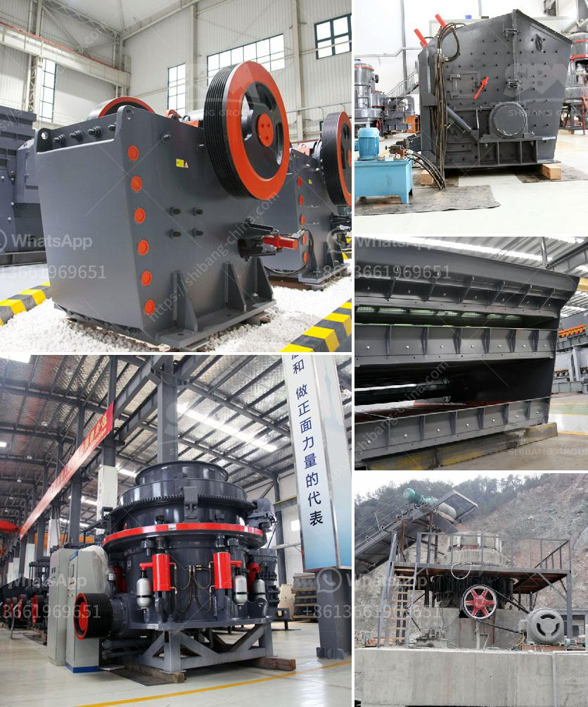

<h3>old hammer mill for sale</h3>
Are you a collector of antique machinery? Or perhaps you are a farmer looking for a unique piece of equipment to enhance your farming operations? Well, look no further! We have an exciting item up for sale - an old hammer mill. This vintage machine is not only a functional tool but also a remarkable piece of history that deserves preservation.

Dating back to the early 1900s, this hammer mill was used to grind grains and other agricultural products into fine powder. It was an essential tool for farmers who relied on it to process their crops into animal feed or meal. Made of sturdy metal, with a large hopper and powerful rotating blades, this hammer mill is a testament to the engineering skills of the past.

While it may no longer serve its original purpose, owning this old hammer mill means owning a unique piece of agricultural heritage. It can be a captivating addition to any farm or collection. Imagine the conversations it could generate with visitors, sparking discussions about the evolution of farming practices and technological advancements.

Moreover, restoring and using this antique hammer mill can be an enjoyable hands-on project for those with a passion for restoration or machinery. By refurbishing it, not only will you bring this piece of history back to life, but you will also gain a sense of accomplishment knowing that you have preserved a valuable part of our agricultural heritage.

Acquiring this vintage hammer mill is a golden opportunity for anyone with an interest in antique machinery. Don’t miss out on this chance! Whether you're a collector, farmer, or simply a history enthusiast, find joy in owning and preserving this old hammer mill. Rest assured, it will not only serve as a functional tool but also a cherished relic that tells a story of bygone eras. Grab this rare item now and make it a centerpiece in your home, farm, or collection!
<h3>Contact us</h3><ul><li><strong>Whatsapp:&nbsp;<a href="https://wa.me/8613661969651">+8613661969651</a></strong></li><li><a href="https://swt.shibang-china.com/?git&amp;zhl&amp;old hammer mill for sale"><strong>Online Service(chat now)</strong></a></li></ul><h3>Related</h3><ul><li><a href='ballast processing plant.md'>ballast processing plant</a></li><li><a href='impact crusher dealer.md'>impact crusher dealer</a></li><li><a href='copper mining process.md'>copper mining process</a></li><li><a href='conventional stone crushers in peru.md'>conventional stone crushers in peru</a></li><li><a href='crusher for crushing limestone.md'>crusher for crushing limestone</a></li></ul>