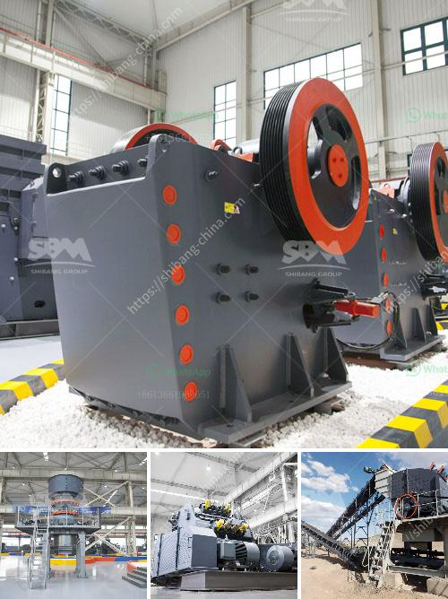

<h3>open cast coal mining machinery process</h3>
Open cast coal mining is a type of surface mining technology used to extract coal resources. This method of mining involves the use of certain heavy machinery like dumpers, excavators, and dozers during the coal mining process. Overburden, which is the top soil, is removed to expose the coal seams underneath. The extent of the deepness is determined by the type of machinery used while extracting the coal deposits.

The open cast coal mining machinery process starts with the removal of the topsoil. This soil, which contains a lot of nutrients, is either stored for future use in agricultural activities or used to reclaim the mined-out area once the coal extraction is complete. The process of removing the topsoil is typically done using heavy excavators equipped with buckets to dig out the soil and load it into dump trucks for transportation.

Once the overburden is removed, the next step involves drilling holes into the exposed coal seams. These holes are then packed with explosives, which are detonated to break apart the coal and facilitate its extraction. This process is known as blasting and is carried out under strict regulations to minimize the impact on neighboring areas. After the blasting, the broken coal is then loaded onto dump trucks or conveyor belts by hydraulic excavators.

Dump trucks, also known as haul trucks, play a crucial role in the open cast coal mining process. These trucks are used to transport the coal from the mining area to the processing plant or storage yard. The size and capacity of the dump trucks vary depending on the scale of the coal mining operation. Some of the largest dump trucks used in open cast coal mining can carry up to 400 tons of material in a single load.

Conveyor belts are another vital component in the open cast coal mining machinery process. These belts are used to transport the coal over long distances, often spanning several kilometers. They can be either fixed or mobile and are typically made of sturdy rubber or metal. Conveyor belts enable the efficient movement of coal, eliminating the need for manual labor and reducing the overall time required for coal transportation.

Moreover, dozers are used in open cast coal mining to level the terrain and create haul roads for the dump trucks. They are also employed to push the blasted coal into piles or stockpiles for temporary storage before further processing. Dozers are powerful machines equipped with large blades that can move substantial amounts of material quickly and efficiently.

In conclusion, open cast coal mining machinery plays a significant role in the process of extracting coal resources from the earth's surface. The heavy machinery involved, such as dump trucks, excavators, and dozers, help remove the overburden, blast the coal, transport it, and store it for further processing. This process is vital for meeting the increasing energy demands of societies worldwide. However, it is crucial to ensure that open cast coal mining is carried out responsibly, with the utmost consideration for environmental conservation and sustainable practices.
<h3>Contact us</h3><ul><li><strong>Whatsapp:&nbsp;<a href="https://wa.me/8613661969651">+8613661969651</a></strong></li><li><a href="https://swt.shibang-china.com/?git&amp;zhl&amp;open cast coal mining machinery process"><strong>Online Service(chat now)</strong></a></li></ul><h3>Related</h3><ul><li><a href='mobile sand making machine.md'>mobile sand making machine</a></li><li><a href='stone crushing plant manufacturer.md'>stone crushing plant manufacturer</a></li><li><a href='mini rock crushers for sale.md'>mini rock crushers for sale</a></li><li><a href='concrete breakers for sale in south africa.md'>concrete breakers for sale in south africa</a></li><li><a href='manganese metal production process.md'>manganese metal production process</a></li></ul>