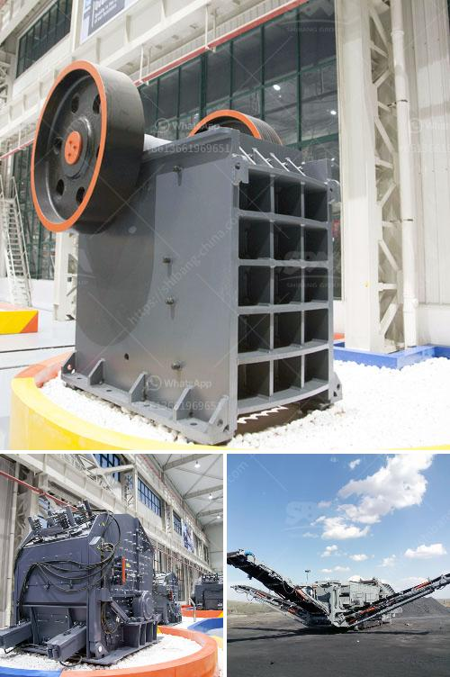

<h3>ore beneficiation equipment suppliers china</h3>
Ore beneficiation is a process that improves the ore grade and removes impurities from the ore. It is an important part of the mining process and is widely used in the mining industry in China. Today, I will introduce the top 5 ore beneficiation equipment suppliers in China.

1.Hongxing Machinery: Founded in 1980, Henan Hongxing Machinery is a well-known ore beneficiation equipment supplier in China. The company has been committed to providing high-quality and efficient products to customers around the world. With its own independent research and development team, advanced production equipment, and strict quality control system, Hongxing Machinery ensures the reliability and performance of its products.

2.Zhongde Heavy Industries: With more than 40 years of development, Zhongde Heavy Industries has become a well-known supplier of mining equipment in China. The company specializes in the production of various ore beneficiation equipment, including crushers, ball mills, magnetic separators, flotation machines, and more. Zhongde Heavy Industries' products are not only sold well in China but also exported to many countries and regions around the world.

3.Yantai Fulin Mining Machinery: Yantai Fulin Mining Machinery Co., Ltd. is a comprehensive mining service enterprise specializing in the design, manufacturing, installation, and debugging of mining equipment. The company mainly produces beneficiation equipment, such as crushers, ball mills, flotation machines, and magnetic separators. With its advanced processing equipment and strict quality control system, Yantai Fulin Mining Machinery provides customers with high-quality products and excellent after-sales service.

4.CITIC HIC: CITIC HIC is a leading industrial equipment supplier in China. The company provides a wide range of products for the mining industry, including ore beneficiation equipment. CITIC HIC's products have been successfully applied in various mining projects worldwide, demonstrating their reliability and efficiency.

5.Shandong Xinhai Mining Technology & Equipment Inc.: Shandong Xinhai Mining Technology & Equipment Inc. is a well-known supplier of mineral processing equipment in China. The company specializes in the design, manufacturing, installation, and commissioning of various mineral processing equipment, including crushers, ball mills, flotation machines, and magnetic separators. With its strong technical strength and rich experience, Shandong Xinhai Mining Technology & Equipment Inc. has won the trust of many customers in China and abroad.

In conclusion, these top ore beneficiation equipment suppliers in China have played a crucial role in the development of the mining industry. Their high-quality products and reliable after-sales service have greatly improved the efficiency of ore beneficiation processes, contributing to the sustainable development of the mining industry in China.
<h3>Contact us</h3><ul><li><strong>Whatsapp:&nbsp;<a href="https://wa.me/8613661969651">+8613661969651</a></strong></li><li><a href="https://swt.shibang-china.com/?git&amp;zhl&amp;ore beneficiation equipment suppliers china"><strong>Online Service(chat now)</strong></a></li></ul><h3>Related</h3><ul><li><a href='layout design for stone crushing plant.md'>layout design for stone crushing plant</a></li><li><a href='talc grinding plant.md'>talc grinding plant</a></li><li><a href='how to calculate tph of a cone crusher.md'>how to calculate tph of a cone crusher</a></li><li><a href='manganese metal production process.md'>manganese metal production process</a></li><li><a href='gold refining equipment toronto.md'>gold refining equipment toronto</a></li></ul>