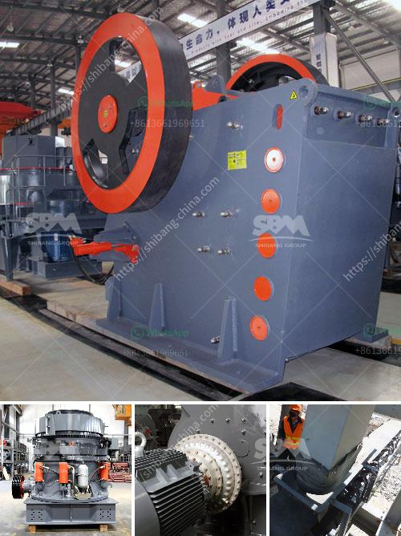

<h3>ore crusher for sale</h3>
Ore crusher, commonly known as jaw crusher, is often used as a primary crusher which is used for a variety of stone crushing production line. Raw materials can be broken into different sizes of particles even a smaller one. Crushers like this are widely used in industrial and mining industries. The essential purpose of ore crushers is to empower their users to achieve the extraction process effortlessly.

Ore crushers for sale come in varied sizes and features. Choosing a suitable one is crucial for achieving desired results. Here are some factors to consider when selecting your next ore crusher.

Firstly, take into account the characteristics of the raw material. Different ores have different hardness levels, compressive strengths, and abrasiveness. Some ores are soft, while others are hard and require more force to crush them efficiently. Understanding the properties of the ore will help you determine the type of crusher that suits your needs.

Secondly, you must consider the desired output size. Different crushers have different settings that allow you to adjust the size of the final product. For instance, a jaw crusher can produce a range of particle sizes by adjusting the gap between the fixed and moving jaw plates. It is crucial to select a crusher that can produce the desired output size for your specific application.

Furthermore, the capacity of the crusher is another crucial factor to consider. The capacity is determined by the size and speed of the crusher. For larger operations, a crusher with a higher capacity will ensure the continuous and efficient processing of the ores. On the other hand, for smaller operations, a crusher with a lower capacity may suffice.

Lastly, the operating cost of the crusher should be taken into consideration. Purchasing an ore crusher for sale is a long-term investment. Therefore, it is essential to analyze the operating costs associated with the crusher, such as fuel consumption, maintenance, and repair costs. Choosing a crusher with low operating costs will help you maximize your return on investment.

In summary, purchasing an ore crusher for sale requires careful consideration of various factors. Understanding the characteristics of the raw material, the desired output size, the capacity requirements, and the operating costs are essential in making the right decision. With the right ore crusher, you can ensure efficient and cost-effective ore processing.

When looking for an ore crusher for sale, it is advisable to consult reputable manufacturers or suppliers who have extensive experience in the industry. They can provide guidance on selecting the most suitable crusher for your specific needs. Additionally, it is recommended to compare prices and features of different crushers to ensure you get the best value for your investment.

Investing in a high-quality ore crusher will enhance your overall productivity and profitability. With the right equipment, you can efficiently process various types of ores and increase your output. Take your time to research and choose the best ore crusher for sale that suits your requirements, and start benefiting from its efficient and reliable crushing capabilities.
<h3>Contact us</h3><ul><li><strong>Whatsapp:&nbsp;<a href="https://wa.me/8613661969651">+8613661969651</a></strong></li><li><a href="https://swt.shibang-china.com/?git&amp;zhl&amp;ore crusher for sale"><strong>Online Service(chat now)</strong></a></li></ul><h3>Related</h3><ul><li><a href='price of mobile crusher.md'>price of mobile crusher</a></li><li><a href='tanzania stone crusher machine.md'>tanzania stone crusher machine</a></li><li><a href='roks vertical mill.md'>roks vertical mill</a></li><li><a href='types and prices of grinding machines.md'>types and prices of grinding machines</a></li><li><a href='mobile sand making machine.md'>mobile sand making machine</a></li></ul>