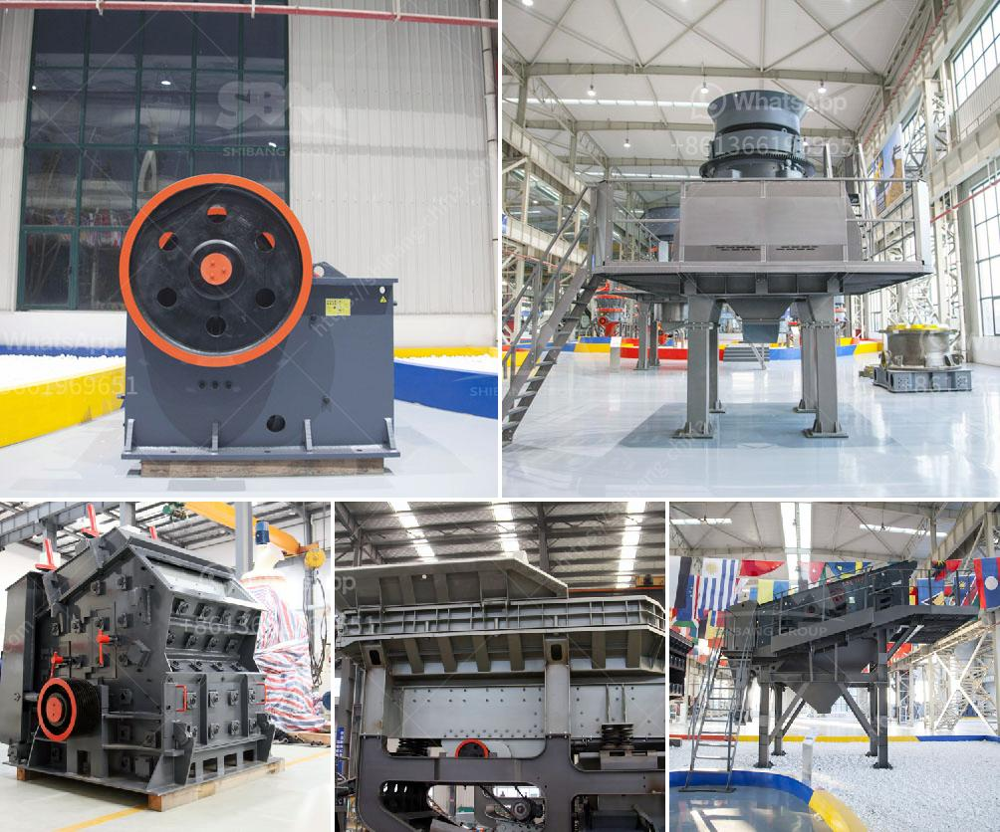

<h3>ore grinding mills china</h3>
Ore grinding mills are essential equipment in the mining and mineral processing industry. These mills play an important role in breaking hard and large materials into smaller pieces for further processing. As China continues to lead the global mining industry, the demand for ore grinding mills has grown significantly in recent years, making China a major player in this sector.

China's mining industry is one of the largest in the world, with abundant mineral resources that need to be extracted and processed. To meet the increasing demand for minerals, the Chinese government has encouraged the development of advanced technologies and equipment to enhance efficiency and productivity in the mining sector. This has paved the way for the rise of ore grinding mills in China.

Chinese manufacturers have been quick to respond to this market opportunity. They have focused on producing high-quality, efficient, and cost-effective grinding mills that cater to the specific needs of the mining industry. China's ore grinding mills are known for their reliability, durability, and ability to handle a wide range of ores.

One of the main advantages of Chinese ore grinding mills is their competitive pricing. Chinese manufacturers can produce these mills at a lower cost due to several factors, including lower labor costs and a well-established supply chain. As a result, China has become an attractive destination for mining companies seeking affordable yet efficient grinding mills.

Furthermore, Chinese manufacturers have invested heavily in research and development to improve the performance of their grinding mills. Cutting-edge technologies, such as advanced control systems, energy-efficient designs, and wear-resistant materials, have been incorporated into their products. This focus on innovation has allowed Chinese mills to provide better grinding solutions, resulting in higher productivity and reduced operating costs for mining companies.

Chinese ore grinding mills are also known for their environmental sustainability. With growing concerns over the impact of mining activities on the environment, Chinese manufacturers have embraced green technologies in their production processes. These mills incorporate energy-saving measures, such as the use of renewable energy sources, as well as effective dust control systems to minimize air pollution.

The popularity of Chinese ore grinding mills is not limited to China alone. These mills are exported to many countries around the world, particularly in developing regions with a high demand for minerals. Chinese manufacturers have established partnerships with international mining companies, further expanding their market reach and contributing to the global mining industry.

In conclusion, China has emerged as a dominant force in the production of ore grinding mills. The country's mining industry, coupled with the government's focus on technological advancements and environmental sustainability, has fueled the growth of Chinese manufacturers in this sector. With competitive pricing, innovative designs, and a strong commitment to quality, Chinese ore grinding mills have become a go-to choice for mining companies worldwide. As the demand for minerals continues to rise, China's ore grinding mills will play an even more crucial role in the global mining industry.
<h3>Contact us</h3><ul><li><strong>Whatsapp:&nbsp;<a href="https://wa.me/8613661969651">+8613661969651</a></strong></li><li><a href="https://swt.shibang-china.com/?git&amp;zhl&amp;ore grinding mills china"><strong>Online Service(chat now)</strong></a></li></ul><h3>Related</h3><ul><li><a href='vertical mill size distribution.md'>vertical mill size distribution</a></li><li><a href='limestone ball mill machine.md'>limestone ball mill machine</a></li><li><a href='stone crusher plant video.md'>stone crusher plant video</a></li><li><a href='crusher plant germany.md'>crusher plant germany</a></li><li><a href='stone crusher machinery list in india.md'>stone crusher machinery list in india</a></li></ul>