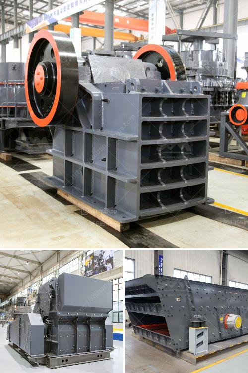

<h3>overflow type ball mill</h3>
The overflow type ball mill is widely used in cement, mineral, refractory material and other industries. It is divided into two main types: wet and dry ball mills. According to different discharge methods, it can be divided into grid type and overflow type.

The overflow type ball mill is equipped with a simple structure and easy maintenance. It has a grinding medium in the barrel body, and steel balls are used as grinding media. When the barrel rotates, the grinding medium is attached to the wall of the barrel due to inertial centrifugal force. After rotating with the barrel body and reaching a certain height, it will fall freely, which will crush and grind the material.

Compared with the grid type ball mill, the overflow type ball mill has a low product particle size ratio. The fine powder material is discharged in time to avoid over-grinding and the circulating load is reduced. The overflow discharge has a simple structure, no grid plate to block, and the slight ball filling rate is advantageous for the discharge. Moreover, the overflow type ball mill has a slow pulp discharging speed, and the slurry level in the barrel is lower than the lower edge of the hollow shaft, thereby reducing the height of the slurry surface and reducing the power consumption.

In addition, the structure of the overflow type ball mill is simple and flexible, and it is equipped with heat-resistant and wear-resistant lining plates made of composite materials, which have long service life and easy replacement. The fineness of the product can be adjusted, and the overflow type ball mill has a wide range of applications.

In summary, the overflow type ball mill has many advantages, such as convenient operation, simple structure, low investment cost, and high production efficiency. It is favored by many users in the industry. Whether it is used in the cement industry, mineral industry or other fields, the overflow type ball mill is a highly efficient equipment that deserves attention and recognition.
<h3>Contact us</h3><ul><li><strong>Whatsapp:&nbsp;<a href="https://wa.me/8613661969651">+8613661969651</a></strong></li><li><a href="https://swt.shibang-china.com/?git&amp;zhl&amp;overflow type ball mill"><strong>Online Service(chat now)</strong></a></li></ul><h3>Related</h3><ul><li><a href='gold refining equipment toronto.md'>gold refining equipment toronto</a></li><li><a href='mini cement plant in west bengal.md'>mini cement plant in west bengal</a></li><li><a href='mobile crushing plant for sale in africa.md'>mobile crushing plant for sale in africa</a></li><li><a href='mobile stone crusher suppliers.md'>mobile stone crusher suppliers</a></li><li><a href='used jaw mobile crusher in uae.md'>used jaw mobile crusher in uae</a></li></ul>