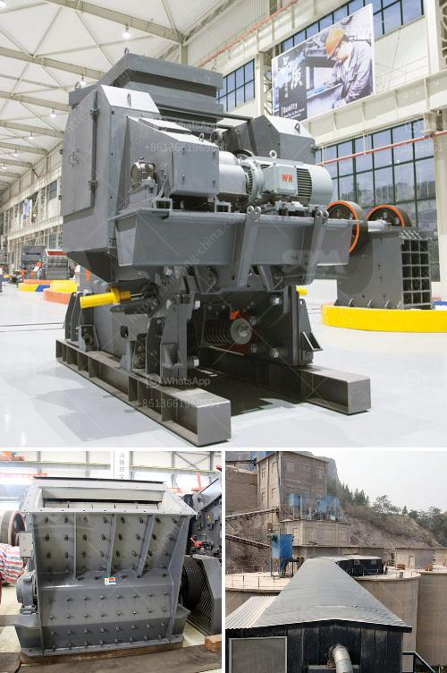

<h3>part of hammer mill</h3>
The hammer mill is a type of grinding machine that provides a high-speed rotary action to shred hard materials. It consists of a feeding hopper, a crushing chamber, and a delivery device. The full extent of its operation depends on the rotation speed, scripting, and the kind of hammer attached. With these fundamental mechanical parts, anyone who uses a hammer mill can benefit immensely from its features.

One crucial part of the hammer mill is the screen. It is responsible for particle separation, depending on the size desired. Screens can have different hole sizes to allow for various minimum particle sizes. This way, the screen ensures uniformity in particle size, ensuring consistency in the final product.

The screen serves as a protective barrier for the rotor. A properly-sized screen reduces the risk of clogging and minimizes the wear on the hammers. It also increases the overall efficiency of the grinding process since the loads on the machine are distributed evenly.

The rotor is the beating heart of the hammer mill. As the hammers hit the materials, they create a rotating force that pulverizes the bulk material into smaller particles. The rotor is critical in ensuring that the materials are pulverized to the desired size.

In addition to the screen and rotor, the hammers play a vital role in the grinding process. These hammers, attached to the rotor, impact the materials as the rotor spins at high speeds. The number, size, and shape of the hammers significantly influence the grinding capacity and performance of the hammer mill. Properly chosen hammers can increase the effectiveness of the hammer mill by providing a more consistent and uniform particle size and reducing energy consumption.

It is crucial to select the appropriate hammers for specific applications. Some hammers are more suitable for coarse grinding, while others excel in fine grinding. The type of material being processed and the desired outcome also play a role in selecting hammers. For example, hammers with a larger surface area are better for grinding soft materials, such as corn, while smaller, more pointed hammers are ideal for grinding tougher materials like wood or biomass.

Regular maintenance of the hammer mill is essential in ensuring its optimal performance and extending its lifespan. Proper cleaning and inspection of the screen, rotor, and hammers help to identify any signs of wear or damage that may affect the machine's efficiency.

In conclusion, the screen, rotor, and hammers are essential parts of a hammer mill. The screen facilitates particle separation, ensuring uniformity in the final product. The rotor, driven by the hammers, is responsible for pulverizing the materials into smaller particles. The hammers, in turn, play a vital role in the grinding process by impacting the materials and determining the particle size. Understanding these components and their functions is crucial for maximizing the hammer mill's efficiency and productivity.
<h3>Contact us</h3><ul><li><strong>Whatsapp:&nbsp;<a href="https://wa.me/8613661969651">+8613661969651</a></strong></li><li><a href="https://swt.shibang-china.com/?git&amp;zhl&amp;part of hammer mill"><strong>Online Service(chat now)</strong></a></li></ul><h3>Related</h3><ul><li><a href='copper factory layout design.md'>copper factory layout design</a></li><li><a href='jaw crusher for 100x200.md'>jaw crusher for 100x200</a></li><li><a href='small sand washing machine.md'>small sand washing machine</a></li><li><a href='bauxite processing crusher.md'>bauxite processing crusher</a></li><li><a href='hammer mill machine 20hp.md'>hammer mill machine 20hp</a></li></ul>