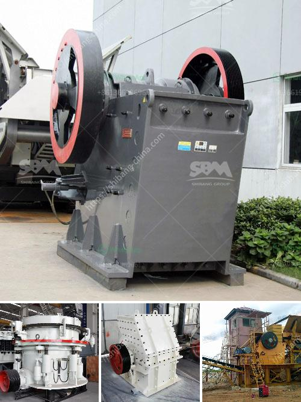

<h3>pf trituradora de impacto</h3>
PF trituradora de impacto, also known as the Impact Crusher, is a versatile and efficient machine that is widely used in the quarrying, mining, recycling, and demolition industries. It is a crucial equipment for crushing various types of materials such as limestone, granite, concrete, iron ore, and many others.

The PF trituradora de impacto is designed with high-speed rotation of the rotor in the crushing chamber. This allows the materials to be fed into the crushing cavity at a high speed and be crushed by the impact of the hammer bars. The crushed materials are then thrown to the impact plates on the rotor for secondary crushing. This process ensures that the product is of uniform size and shape, with a high reduction ratio.

One of the main advantages of the PF trituradora de impacto is its robust construction. The machine is built with a heavy-duty steel frame and a reinforced impact plate to withstand the high impact forces. This ensures that the machine can be used in demanding applications and can handle even the toughest materials.

Another advantage is the adjustable discharge opening. The PF trituradora de impacto allows the user to control the size of the final product by adjusting the gap between the impact plates and the rotor. This feature is particularly useful when producing different sizes of aggregates or when removing fines from the material.

Additionally, the machine is equipped with a hydraulic system that allows for easy maintenance and adjustment. The hydraulic system can quickly open the housing for inspection and maintenance, ensuring that the machine is always in optimal condition.

The PF trituradora de impacto is widely used in various industries due to its versatility. It can be used for primary, secondary, and tertiary crushing of various materials. In the mining industry, it is commonly used for crushing coal, limestone, and other minerals. In the construction industry, it is used for crushing concrete, asphalt, and other construction materials.

Furthermore, the machine is often used for recycling applications. It can crush and process recycled concrete, bricks, and asphalt to produce aggregates for use in new construction projects. This helps reduce the demand for natural resources and decreases the environmental impact of construction activities.

The PF trituradora de impacto is a reliable and efficient machine that offers numerous benefits for various industries. With its high-speed rotor and robust construction, it can handle a wide range of materials and produce high-quality products. Its adjustable discharge opening and hydraulic system make it a user-friendly and easy-to-maintain machine.

Whether in mining, quarrying, recycling, or demolition, the PF trituradora de impacto is a valuable tool that can help improve productivity and reduce costs. Its versatility and efficiency make it a popular choice among professionals in the industry.
<h3>Contact us</h3><ul><li><strong>Whatsapp:&nbsp;<a href="https://wa.me/8613661969651">+8613661969651</a></strong></li><li><a href="https://swt.shibang-china.com/?git&amp;zhl&amp;pf trituradora de impacto"><strong>Online Service(chat now)</strong></a></li></ul><h3>Related</h3><ul><li><a href='crusher for quarry.md'>crusher for quarry</a></li><li><a href='crusher dimensions crusher conica.md'>crusher dimensions crusher conica</a></li><li><a href='pulverizer crusher manufacturer in rajkot india.md'>pulverizer crusher manufacturer in rajkot india</a></li><li><a href='price of large jaw crusher.md'>price of large jaw crusher</a></li><li><a href='marble crusher for sale.md'>marble crusher for sale</a></li></ul>