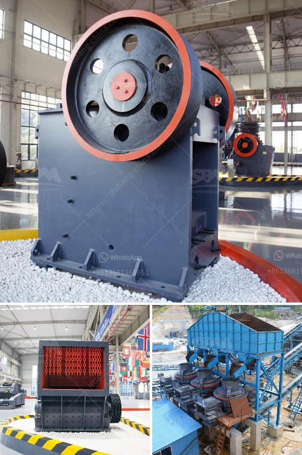

<h3>pfw impact crusher</h3>
Crushing is an important process in many industrial applications. Whether it is limestone, granite, or any other material, various types of crushers are employed to achieve the desired size reduction. One such crushing machine is the PFW Impact Crusher.

The PFW Impact Crusher is a versatile and efficient crushing machine that can be used in a variety of crushing applications. Its exceptional shape and impeccable performance make it an ideal choice for various operations, such as aggregate production, mining, and recycling.

One of the key features of the PFW Impact Crusher is its unique rotor design. The rotor is the heart of the crusher, responsible for producing high-speed impact forces that efficiently break the material into smaller sizes. The robust design of the rotor ensures maximum durability and reliability, even in the most demanding conditions.

Equipped with a heavy-duty rotor, the PFW Impact Crusher delivers exceptional performance. The rotor's high rotational inertia allows it to maintain its speed and momentum, delivering powerful impacts to the material being crushed. This ensures a high reduction ratio and excellent particle shape, resulting in superior quality aggregates.

Another standout feature of the PFW Impact Crusher is its adjustable outlet. The crusher allows users to adjust the gap between the impact plate and the blow bars. This feature enables precise control over the final product size, allowing users to produce aggregates of different sizes to meet specific requirements.

Furthermore, the PFW Impact Crusher is equipped with a hydraulic system that ensures the convenient and quick adjustment of the impact aprons. This hydraulic system also provides overload protection, preventing any damage to the crusher in case of excessive load or material jamming.

In addition to its outstanding performance and versatility, the PFW Impact Crusher boasts an ergonomic and user-friendly design. The crusher's compact size and lightweight construction make it easy to transport and maneuver, enabling operators to set it up quickly and efficiently in different work environments.

Moreover, the PFW Impact Crusher is equipped with advanced technologies to enhance its overall efficiency. The integrated automation system allows users to monitor and control various parameters in real-time, optimizing the crusher's performance and reducing downtime. The crusher is also equipped with a dust suppression system, ensuring a clean and safe working environment.

In conclusion, the PFW Impact Crusher is a versatile and efficient crushing machine that delivers exceptional performance in various applications. Its unique rotor design, adjustable outlet, and advanced technologies make it an ideal choice for aggregate production, mining, and recycling operations. With its compact size and user-friendly design, the PFW Impact Crusher is a reliable and efficient solution for crushing needs.
<h3>Contact us</h3><ul><li><strong>Whatsapp:&nbsp;<a href="https://wa.me/8613661969651">+8613661969651</a></strong></li><li><a href="https://swt.shibang-china.com/?git&amp;zhl&amp;pfw impact crusher"><strong>Online Service(chat now)</strong></a></li></ul><h3>Related</h3><ul><li><a href='used hammer mill crusher.md'>used hammer mill crusher</a></li><li><a href='production process of gypsum.md'>production process of gypsum</a></li><li><a href='prices for cement processing machines.md'>prices for cement processing machines</a></li><li><a href='portable crushing mill.md'>portable crushing mill</a></li><li><a href='complete crushing plant 150 200t.md'>complete crushing plant 150 200t</a></li></ul>