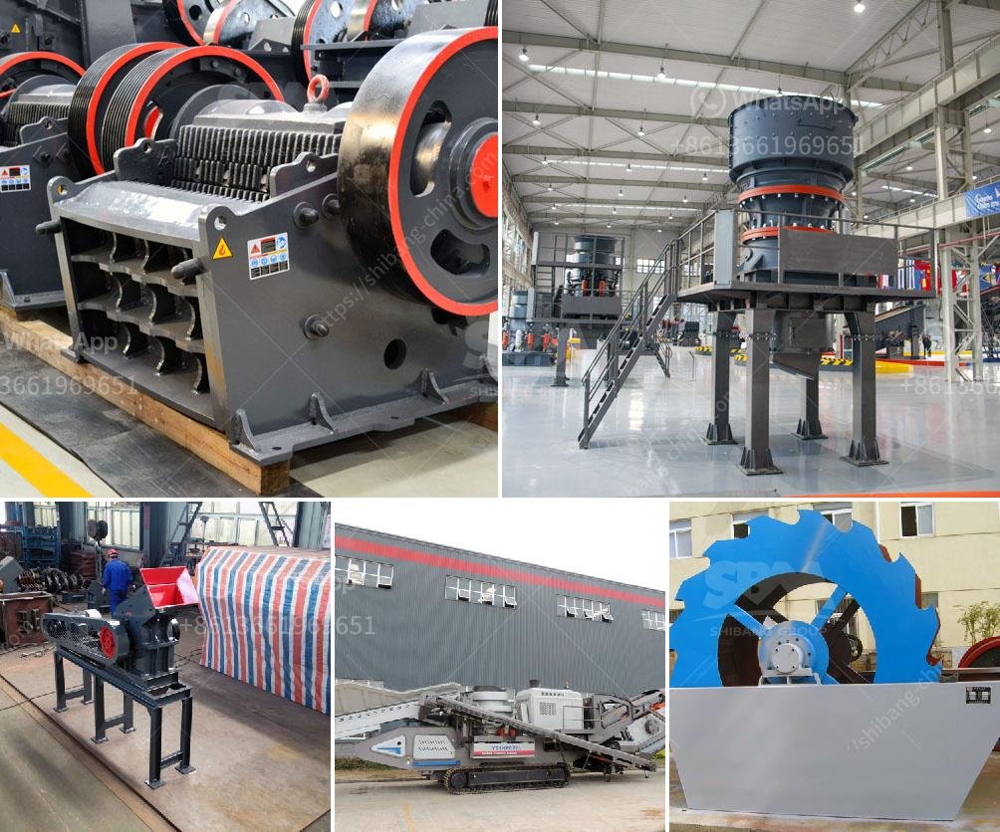

<h3>philippines crusher equipment</h3>
The Philippines is one of the fastest-growing economies in Southeast Asia, with expanding industries such as construction, mining, and infrastructure development. With these booming sectors, the demand for crusher equipment is also increasing.

Crushers are essential pieces of machinery for various industries, such as mining, construction, and manufacturing. They are commonly used to crush large rocks, ore, or other materials into smaller sizes for further processing or end-use. 

In the Philippines, crusher equipment plays a crucial role in the construction and mining industries. These machines are primarily used to break down large rocks, ensuring that valuable materials can be extracted or processed efficiently. They are capable of reducing the size of materials to a consistent and manageable level, which is essential for subsequent processing steps.

There are different types of crushers available in the market, each designed to handle specific materials and processing requirements. Jaw crushers, cone crushers, and impact crushers are some of the commonly used crusher equipment in the Philippines. Jaw crushers are ideal for primary crushing, while cone crushers are used for secondary or tertiary crushing. Impact crushers, on the other hand, are used to crush materials with high toughness and hardness.

In the Philippines, several reputable manufacturers offer a wide range of crusher equipment made from high-quality materials. These machines are durable, powerful, and efficient, ensuring that they can withstand heavy-duty applications. They are also designed to be user-friendly, with features that make maintenance and operation hassle-free.

Moreover, crusher equipment in the Philippines is often equipped with advanced technology to improve efficiency and productivity. For instance, some crushers have automated systems that allow for remote monitoring and adjustment of settings. This ensures that the machines operate at optimal levels, leading to better overall performance.

In conclusion, crusher equipment is indispensable in the Philippines' construction and mining industries, enabling the efficient extraction and processing of materials. With the increasing demand for infrastructure development and mineral resources, investing in quality crusher equipment is crucial for businesses to stay competitive in the market.
<h3>Contact us</h3><ul><li><strong>Whatsapp:&nbsp;<a href="https://wa.me/8613661969651">+8613661969651</a></strong></li><li><a href="https://swt.shibang-china.com/?git&amp;zhl&amp;philippines crusher equipment"><strong>Online Service(chat now)</strong></a></li></ul><h3>Related</h3><ul><li><a href='granite crusher machine.md'>granite crusher machine</a></li><li><a href='limestone crusher kenya.md'>limestone crusher kenya</a></li><li><a href='best machine for coal grinding.md'>best machine for coal grinding</a></li><li><a href='impact crusher dealer.md'>impact crusher dealer</a></li><li><a href='process of preparation of coal and asha.md'>process of preparation of coal and asha</a></li></ul>