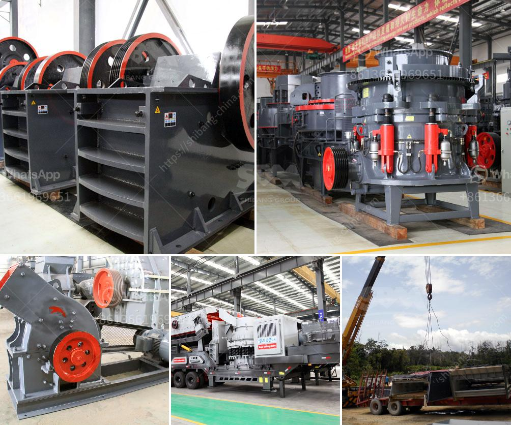

<h3>portable crushing equipment</h3>
In the world of construction, time is money. Every minute spent setting up, tearing down, and transporting equipment is money lost. This is where portable crushing equipment comes into play, revolutionizing the construction industry and making projects more efficient and cost-effective.

Portable crushing equipment refers to mobile crushers and screeners used for crushing and screening rocks, stone, and other materials for construction purposes. This equipment is designed to be easily transported and can be quickly set up at the job site. It eliminates the need for costly transportation and allows contractors to save time and money on their projects.

One of the significant advantages of portable crushing equipment is its versatility. It can crush and screen various materials, including concrete, asphalt, and natural stone, making it suitable for a wide range of construction applications. Whether it's building roads, bridges, or foundations, portable crushers and screeners can efficiently process the necessary materials, reducing the need for multiple equipment and saving valuable resources.

The compact design and mobility of portable crushing equipment make it perfect for remote and hard-to-reach locations. Construction projects in rural areas or sites with limited access can benefit from portable crushers and screeners, as they can be easily transported to these locations and set up in a short amount of time. This eliminates the need for long-distance transportation of materials and reduces the overall project duration.

Another advantage of portable crushing equipment is its ability to produce high-quality aggregates. With advanced technology and efficient crushing processes, these machines can produce consistent and uniform aggregates, meeting the required specifications. This ensures that the construction projects are built to the highest standards, with durable and reliable materials.

Portable crushers and screeners are also environmentally-friendly options in the construction industry. They use less fuel than traditional crushers and generate less noise and dust, minimizing the impact on the surroundings. This promotes sustainability and allows contractors to comply with environmental regulations while still achieving their construction goals.

Furthermore, portable crushing equipment offers cost savings to construction companies. With a reduced need for transportation and fewer requirements for additional equipment, contractors can significantly lower their operational costs. The quick set-up and tear-down time of portable crushers and screeners also contribute to increased productivity and reduced labor costs, making them a cost-effective choice for construction projects.

In conclusion, portable crushing equipment has become a game-changer in the construction industry. With its versatility, mobility, and ability to produce high-quality aggregates, it provides a more efficient and cost-effective solution for construction projects. Contractors can save time, money, and resources by using portable crushers and screeners, improving their overall productivity and profitability. As technology continues to advance, portable crushing equipment will continue to evolve, making construction projects faster, more efficient, and environmentally-friendly.
<h3>Contact us</h3><ul><li><strong>Whatsapp:&nbsp;<a href="https://wa.me/8613661969651">+8613661969651</a></strong></li><li><a href="https://swt.shibang-china.com/?git&amp;zhl&amp;portable crushing equipment"><strong>Online Service(chat now)</strong></a></li></ul><h3>Related</h3><ul><li><a href='silica sand processing plant.md'>silica sand processing plant</a></li><li><a href='list of quarry crusher company in the philippines.md'>list of quarry crusher company in the philippines</a></li><li><a href='how to make marble powder statues.md'>how to make marble powder statues</a></li><li><a href='iron crushing machine for sale.md'>iron crushing machine for sale</a></li><li><a href='raymond mill to crusher quartz to 1500 mesh.md'>raymond mill to crusher quartz to 1500 mesh</a></li></ul>