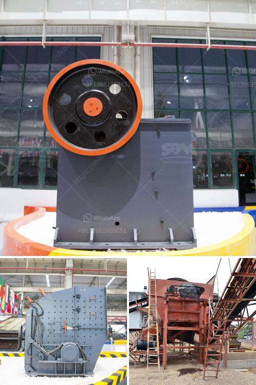

<h3>portable crushing mill</h3>
In recent years, the demand for aggregates has been rapidly increasing, driven by the growth in construction and infrastructure projects worldwide. To meet this surge in demand, crushers and mills have become essential equipment in the mining and construction industry. Among these machines, portable crushing mills are gaining immense popularity due to their convenience and efficiency.

A portable crushing mill combines a crusher, mill, and screening system in one powerful unit. This compact machine can be easily transported between job sites, allowing operators to crush and process materials on-site, eliminating the need for costly transportation and reducing the overall project timeline.

One of the key advantages of a portable crushing mill is its versatility. It can handle various types of materials, including concrete, asphalt, and rocks of different sizes. With adjustable settings, operators can achieve the desired product sizes ranging from coarse gravel to fine sand. This flexibility makes the portable crushing mill suitable for a wide range of applications, from road construction to mining operations.

Moreover, portable crushing mills are equipped with advanced technology designed to optimize productivity and efficiency. Features such as remote monitoring, automatic control systems, and real-time data analysis allow operators to monitor and control the machine's performance from a centralized location. This improves safety, reduces downtime, and maximizes the overall output.

The environmental impact of portable crushing mills is also commendable. With advancements in dust suppression systems and noise reduction technologies, these machines operate in an eco-friendly manner. This is crucial for companies aiming to adhere to sustainability practices and minimize their carbon footprint.

In conclusion, portable crushing mills have revolutionized the crushing industry by providing a compact, versatile, and efficient solution for on-site material processing. They have become indispensable in meeting the growing demand for aggregates while reducing operational costs and project timelines. With continuous advancements in technology, these machines will continue to evolve, ensuring that the construction and mining sectors can effectively and sustainably meet the ever-increasing demand for aggregates.
<h3>Contact us</h3><ul><li><strong>Whatsapp:&nbsp;<a href="https://wa.me/8613661969651">+8613661969651</a></strong></li><li><a href="https://swt.shibang-china.com/?git&amp;zhl&amp;portable crushing mill"><strong>Online Service(chat now)</strong></a></li></ul><h3>Related</h3><ul><li><a href='ton crushing machine.md'>ton crushing machine</a></li><li><a href='china granite crusher.md'>china granite crusher</a></li><li><a href='talcum powder manufacturing process.md'>talcum powder manufacturing process</a></li><li><a href='crusher plant in philippines.md'>crusher plant in philippines</a></li><li><a href='list of quarry crusher company in the philippines.md'>list of quarry crusher company in the philippines</a></li></ul>