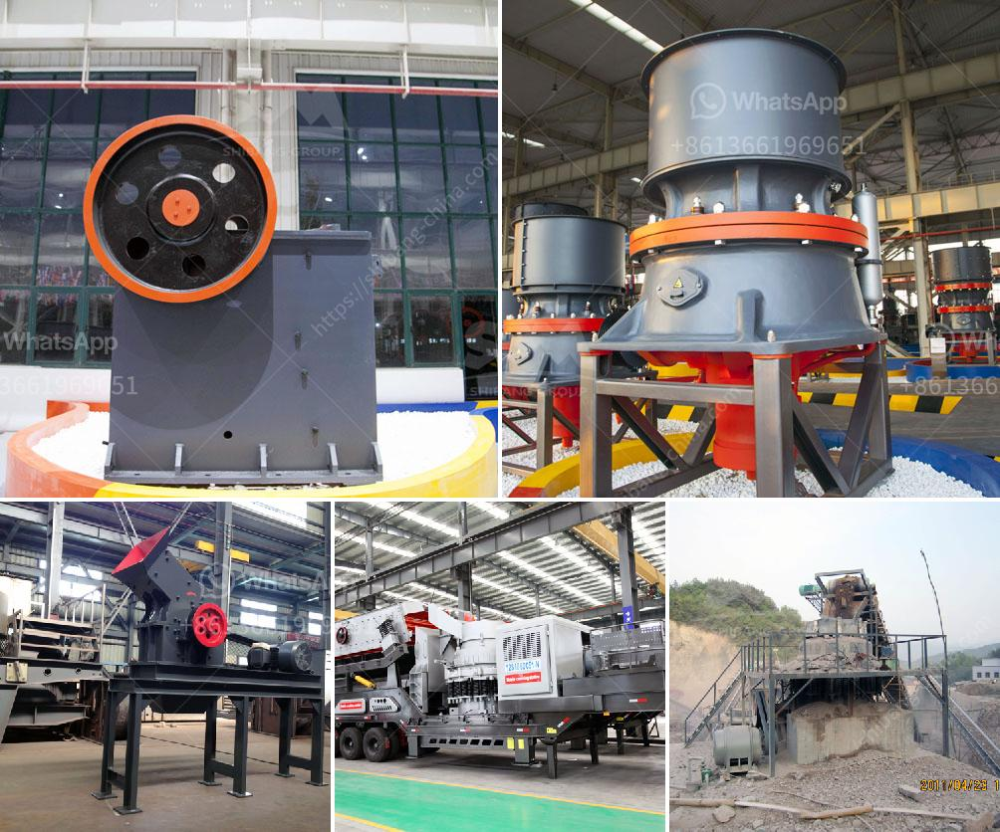

<h3>portable gold rock crushing machine</h3>
The gold mining industry has been a significant economic contributor worldwide for centuries. The process of extracting gold from the earth involves specialized machinery, including crushers, to break the rock into smaller pieces for further processing. In recent years, the development of portable gold rock crushing machines has made the task of crushing rocks into fine powders easier than ever.

Portable gold rock crushing machines are compact and can be conveniently transported to remote locations for on-site crushing. They’re especially useful for crushing hard rock or other materials where a traditional, stationary machine would not be feasible. This is particularly advantageous for small-scale miners or prospectors who need to process smaller quantities of ore.

These portable machines come in various sizes and can handle capacities ranging from 100 to 300 tons per hour, making them suitable for a wide range of applications. They are designed to crush rocks of various hardness levels, from softer materials like limestone to harder rocks such as granite or quartz. This versatility allows operators to tackle different types of ore deposits and adjust their operations accordingly.

One of the main advantages of using portable gold rock crushing machines is their mobility. Unlike fixed crushers that require extensive foundation work and infrastructure, portable machines can be easily transported to different mining sites. This flexibility enables miners to effectively utilize their equipment across multiple locations, maximizing production and reducing downtime.

Additionally, these machines are equipped with advanced features and technology to ensure efficient and precise crushing. They often include adjustable settings, allowing operators to control the output size and optimize the crushing process for their specific needs. Portable crushers also typically have robust safety features, including emergency stop buttons and guards, to protect workers during operation.

In conclusion, portable gold rock crushing machines have revolutionized the gold mining industry by providing a more flexible and efficient way to process ore. They offer mobility, versatility, and ease of use, enabling miners and prospectors to extract gold from different locations with greater ease. With ongoing advancements in technology, these portable machines will likely continue to play a pivotal role in the gold mining industry for years to come.
<h3>Contact us</h3><ul><li><strong>Whatsapp:&nbsp;<a href="https://wa.me/8613661969651">+8613661969651</a></strong></li><li><a href="https://swt.shibang-china.com/?git&amp;zhl&amp;portable gold rock crushing machine"><strong>Online Service(chat now)</strong></a></li></ul><h3>Related</h3><ul><li><a href='marble crusher machinery manufacturer.md'>marble crusher machinery manufacturer</a></li><li><a href='price of diamond mining construction.md'>price of diamond mining construction</a></li><li><a href='small ore grinding mill with 50 tpd for sale.md'>small ore grinding mill with 50 tpd for sale</a></li><li><a href='jaw crusher tanzania.md'>jaw crusher tanzania</a></li><li><a href='hp cone crusher.md'>hp cone crusher</a></li></ul>