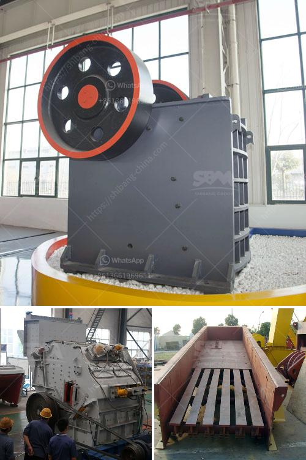

<h3>portable jaw crushers</h3>
Portable jaw crushers are popular crushing machines used for various purposes. The ability to move these machines around the job site is essential in today's fast-paced construction industry. Portable jaw crushers, also known as mobile jaw crushers, are widely used in the mining and construction industries due to their ability to handle all types of rocks and materials.

One of the key advantages of portable jaw crushers is their flexibility. These machines can be moved around the job site, eliminating the need for costly transportation and allowing for efficient on-site crushing. Whether it is a small job or a large construction project, portable jaw crushers are capable of meeting the needs of various applications.

Another benefit of portable jaw crushers is their portability. These machines can be easily transported and set up in different locations, allowing for quick and efficient crushing. With the ability to move around the job site, contractors can easily bring the crusher to the material, reducing the need for expensive transportation and saving time and resources.

In addition to their portability, portable jaw crushers offer remarkable performance. These crushers are designed to handle tough materials, including hard rocks, ores, and demolition debris. Equipped with powerful engines and robust structures, portable jaw crushers can deliver high productivity and superior crushing performance.

Furthermore, portable jaw crushers often come with a range of additional features that enhance their functionality. For example, some models of portable jaw crushers are equipped with a vibrating feeder, allowing for the efficient feeding of materials into the crusher. Others may have a screening unit, which enables the separation of materials into different sizes.

In conclusion, portable jaw crushers are versatile machines that provide mobility, portability, and exceptional crushing capabilities. Their ability to be easily transported and set up in different locations makes them an efficient choice for various job sites. With their powerful engines and robust structures, portable jaw crushers can handle even the toughest materials, guaranteeing high productivity and superior crushing performance.
<h3>Contact us</h3><ul><li><strong>Whatsapp:&nbsp;<a href="https://wa.me/8613661969651">+8613661969651</a></strong></li><li><a href="https://swt.shibang-china.com/?git&amp;zhl&amp;portable jaw crushers"><strong>Online Service(chat now)</strong></a></li></ul><h3>Related</h3><ul><li><a href='china granite crusher.md'>china granite crusher</a></li><li><a href='small mobile rock pulverizer.md'>small mobile rock pulverizer</a></li><li><a href='msi gold wash plant used.md'>msi gold wash plant used</a></li><li><a href='gold mining equipment for sale at malaysia.md'>gold mining equipment for sale at malaysia</a></li><li><a href='stone crushing machine in dubai.md'>stone crushing machine in dubai</a></li></ul>