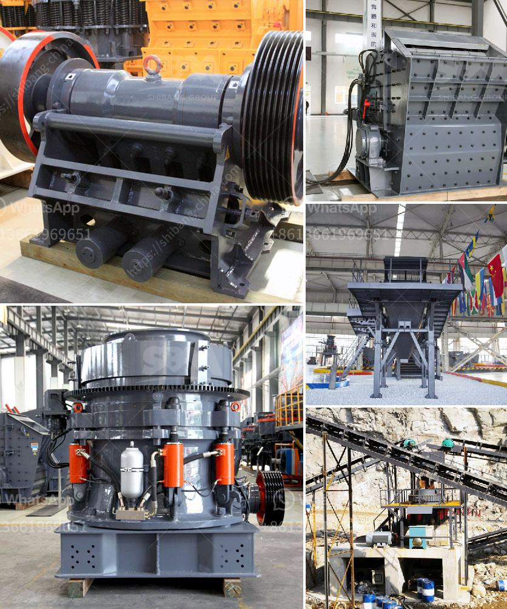

<h3>portable rock crushers bangalore</h3>
Portable rock crushers are widely used in different industries such as mining and construction. The ability to crush different types of materials, especially hard rocks, has made these machines highly in demand. Additionally, these machines are easy to transport and can be used in multiple locations, making them highly versatile.

Bangalore, the capital of Karnataka, is situated in the heart of the Deccan Plateau. Bangalore is known for its vibrant economy and high-tech industries. With the rapid development and urbanization of the city, the demand for construction materials has also increased exponentially. Portable rock crushers have become a key asset in this field to meet the growing demand for aggregates needed for new construction and infrastructure projects.

One of the main advantages of portable rock crushers is their ability to process materials on-site, eliminating the need for transportation of raw materials to a stationary crusher. This not only saves time and money but also reduces the carbon footprint of the construction project. Moreover, portable rock crushers can be easily adjusted to produce different sizes of aggregates, depending on the specific requirements of the project.

In Bangalore, portable rock crushers can be rented or purchased from various suppliers. Some of the renowned suppliers offer both new and used crushers for rent or sale. Depending on the client's budget and requirements, they can choose the right machine to suit their needs. These suppliers also provide excellent after-sales service, including maintenance and spare parts, ensuring that the machines operate efficiently and effectively.

As Bangalore continues to grow and expand, the demand for portable rock crushers will continue to rise. With their ability to crush hard rocks efficiently and their portability, these machines are essential for the construction industry. Whether it's road construction, building construction, or even landscaping projects, portable rock crushers are the go-to solution for crushing and processing materials on-site. Investing in a portable rock crusher in Bangalore can greatly enhance productivity and efficiency, saving time and money while meeting the increasing demand for aggregates in the city.
<h3>Contact us</h3><ul><li><strong>Whatsapp:&nbsp;<a href="https://wa.me/8613661969651">+8613661969651</a></strong></li><li><a href="https://swt.shibang-china.com/?git&amp;zhl&amp;portable rock crushers bangalore"><strong>Online Service(chat now)</strong></a></li></ul><h3>Related</h3><ul><li><a href='ballast processing plant.md'>ballast processing plant</a></li><li><a href='impact jaw crusher.md'>impact jaw crusher</a></li><li><a href='iron washer making machine with price in india.md'>iron washer making machine with price in india</a></li><li><a href='harga mesin crusher batu kapasitas 300 ton per jam.md'>harga mesin crusher batu kapasitas 300 ton per jam</a></li><li><a href='how to start sand business in nigeria.md'>how to start sand business in nigeria</a></li></ul>