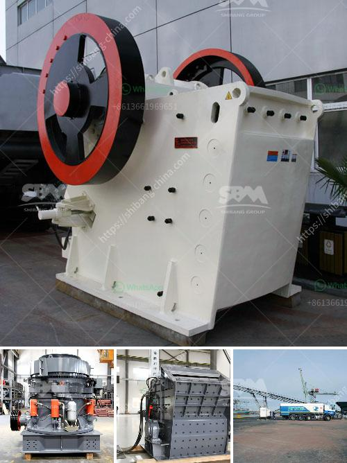

<h3>portable sand and gravel wash plants for sale</h3>
Portable sand and gravel wash plants have become extremely popular in recent years. They offer producers the convenience of mobility while still retaining the ability to efficiently wash and classify sand and gravel materials. These plants can be easily transported to different job sites, making them ideal for construction companies and gravel pits that require frequent relocation.

One of the major advantages of these portable wash plants is their versatility. They can handle a wide range of materials, from fine sand to coarse gravel, and even crushed stone. This allows producers to meet the specific needs of their projects, whether it's creating high-quality concrete aggregates or producing clean, saleable sand for the construction industry.

Another benefit of portable wash plants is their superior efficiency. These plants are equipped with advanced washing and screening systems that ensure effective removal of silt, clay, and other contaminants from the materials. By eliminating these impurities, producers can achieve higher-quality products that meet strict specifications. Moreover, the classified materials can be easily separated into different fractions, allowing for greater flexibility and market adaptability.

When it comes to purchasing portable sand and gravel wash plants, there are various options available in the market. These plants come in different sizes and configurations to meet the specific needs and production capacities of different operations. Some plants are designed for small-scale applications, capable of processing up to 100 tons per hour, while others are larger and can handle up to 300 tons per hour or more.

Additionally, these wash plants are equipped with user-friendly controls and automation systems, making their operation straightforward and efficient. With minimal training, operators can quickly learn how to adjust settings and monitor the plant's performance to ensure optimal productivity and maximize return on investment.

In conclusion, portable sand and gravel wash plants are an excellent solution for producers who value mobility and flexibility. They offer the convenience of on-site washing and classification of materials, allowing for efficient production and delivery of high-quality products. With a wide range of options available, it's important for producers to carefully consider their needs and select a wash plant that best suits their operation.
<h3>Contact us</h3><ul><li><strong>Whatsapp:&nbsp;<a href="https://wa.me/8613661969651">+8613661969651</a></strong></li><li><a href="https://swt.shibang-china.com/?git&amp;zhl&amp;portable sand and gravel wash plants for sale"><strong>Online Service(chat now)</strong></a></li></ul><h3>Related</h3><ul><li><a href='cost per ton quarry production.md'>cost per ton quarry production</a></li><li><a href='cone crusher for salae used.md'>cone crusher for salae used</a></li><li><a href='used coal wash plant canada for sale.md'>used coal wash plant canada for sale</a></li><li><a href='quarry making machine from south africa.md'>quarry making machine from south africa</a></li><li><a href='crusher plant in jizan saudi arabia.md'>crusher plant in jizan saudi arabia</a></li></ul>