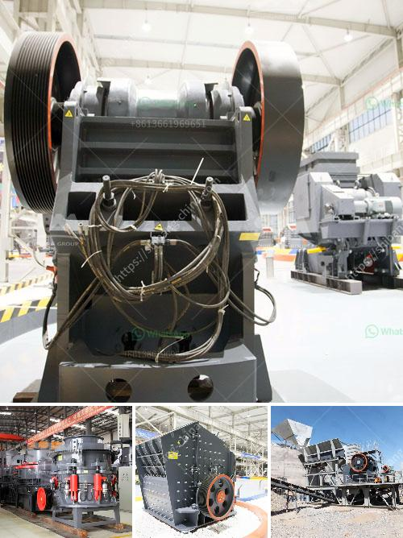

<h3>portable stone crusher for sale</h3>
The advancements in technology have resulted in numerous convenient and portable crushing equipment options. One such piece of equipment is the portable stone crusher. With the ability to be towed behind any vehicle, these crushers are ideal for remote locations on construction sites or in mining operations where heavy machinery is not readily available.

A portable stone crusher is a perfect solution to combat limited space for a conventional crusher or a plant. The portable version is designed to be more maneuverable and easily transported from one location to another. It can be used for crushing various types of rocks, such as limestone, granite, basalt, river pebbles, construction waste, etc. The machine features a high crushing ratio, low energy consumption, and uniform product size.

One of the standout benefits of a portable stone crusher is its versatility. Due to its adaptable design, it can be operated in various environments, including on construction sites, mining sites, and remote locations. Whether you are crushing rocks for infrastructure development or aggregate for a construction project, a portable stone crusher will be the perfect choice.

Another significant advantage of a portable stone crusher is its capability to reduce huge rocks into smaller, more manageable sizes. The machine employs a powerful jaw crusher mechanism that can withstand and handle a variety of types of rocks and ensure its optimal performance. The crusher can pulverize rocks of up to 20 inches in diameter into aggregates of a few millimeters in size, which is highly desirable for construction projects.

Portable stone crushers are equipped with an efficient and highly productive vibrating screening system that ensures that even the smallest rocks are sorted and separated into different sizes before they are crushed. This screening system improves the overall efficiency and output of the crusher, making it perfect for high-demand applications.

The portable stone crusher also features a user-friendly control panel and a simple operator interface. It allows operators to easily adjust the crusher settings, track the crusher's performance, and monitor maintenance needs.

Maintenance of a portable stone crusher is also straightforward. Regular lubrication, inspection of wear parts, and routine cleaning will keep the machine in optimal condition. Portable stone crushers are designed to withstand extreme conditions, providing excellent durability and reliability even in harsh environments.

Portability is a fundamental feature of a portable stone crusher. It can be easily transported from one location to another without the need for extensive installation or foundation work. This makes it an ideal choice for temporary construction projects or remote locations without access to stationary crushing equipment.

Whether you are a contractor, builder, or working in the mining industry, a portable stone crusher for sale should be a priority investment. Its versatility, high crushing capacity, and ease of transportation make it an essential tool for any job site. With its compact design and powerful performance, a portable stone crusher will greatly improve your productivity and efficiency in any construction project.
<h3>Contact us</h3><ul><li><strong>Whatsapp:&nbsp;<a href="https://wa.me/8613661969651">+8613661969651</a></strong></li><li><a href="https://swt.shibang-china.com/?git&amp;zhl&amp;portable stone crusher for sale"><strong>Online Service(chat now)</strong></a></li></ul><h3>Related</h3><ul><li><a href='efficiency energetic efficiency of roller mill.md'>efficiency energetic efficiency of roller mill</a></li><li><a href='dolomite grinding upmesh plant ih india.md'>dolomite grinding upmesh plant ih india</a></li><li><a href='stone crusher plant in punjab.md'>stone crusher plant in punjab</a></li><li><a href='rumus perhitungan kapasitas jaw crusher.md'>rumus perhitungan kapasitas jaw crusher</a></li><li><a href='quarry equipment for sale brisbane.md'>quarry equipment for sale brisbane</a></li></ul>