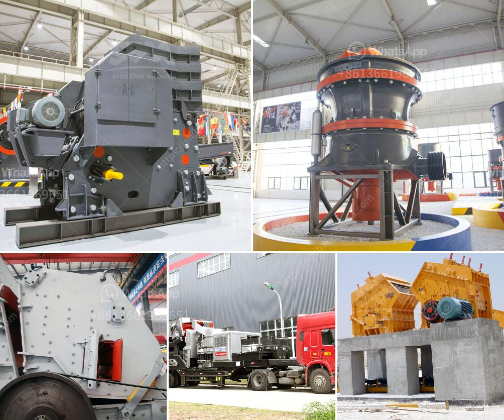

<h3>powder grinding mill price</h3>
Powder grinding mills are essential equipment in the production of various powder materials. They are used for pulverizing minerals, chemicals, and other materials into a fine powder, which is then used in various industries such as mining, construction, ceramics, and more. As the demand for powder materials continues to grow, the price of powder grinding mills becomes an important factor for buyers to consider.

The price of a powder grinding mill can vary depending on various factors such as the capacity, motor power, brand reputation, and after-sales service. Generally, higher capacity and motor power can result in higher prices. Additionally, mills from well-known and reputable brands tend to be more expensive due to their superior quality and reliability.

The range of powder grinding mill prices is quite extensive, ranging from a few thousand dollars to tens of thousands of dollars. Mills with a higher capacity and larger motor power usually have a higher price tag. However, it is important to note that price alone should not be the sole determining factor when purchasing a powder grinding mill.

Buyers should also consider the after-sales service provided by the manufacturer. A reliable manufacturer will not only provide quality products but also offer excellent customer support, including technical assistance, spare parts availability, and warranty coverage. Investing in a mill from a reputable manufacturer may be more expensive initially, but will save money and headaches in the long run.

Furthermore, buyers should also consider their specific needs and requirements before purchasing a powder grinding mill. Factors such as the type of material to be ground, desired fineness, and production capacity all play a role in determining the right mill for their purposes. It is important to choose a mill that is suitable for the specific application to achieve optimal results.

In conclusion, the price of powder grinding mills can vary significantly depending on various factors. While price is an important consideration, buyers should also prioritize factors such as capacity, motor power, brand reputation, and after-sales service. By considering these factors and choosing a mill that meets their specific needs, buyers can make an informed decision and optimize their grinding operations.
<h3>Contact us</h3><ul><li><strong>Whatsapp:&nbsp;<a href="https://wa.me/8613661969651">+8613661969651</a></strong></li><li><a href="https://swt.shibang-china.com/?git&amp;zhl&amp;powder grinding mill price"><strong>Online Service(chat now)</strong></a></li></ul><h3>Related</h3><ul><li><a href='marble processing plant nigeria.md'>marble processing plant nigeria</a></li><li><a href='vertical mill manufacturers.md'>vertical mill manufacturers</a></li><li><a href='coal crusher machine in south africa.md'>coal crusher machine in south africa</a></li><li><a href='ball mill outpot capicity 180 tph.md'>ball mill outpot capicity 180 tph</a></li><li><a href='rock crusher production screen mesh.md'>rock crusher production screen mesh</a></li></ul>