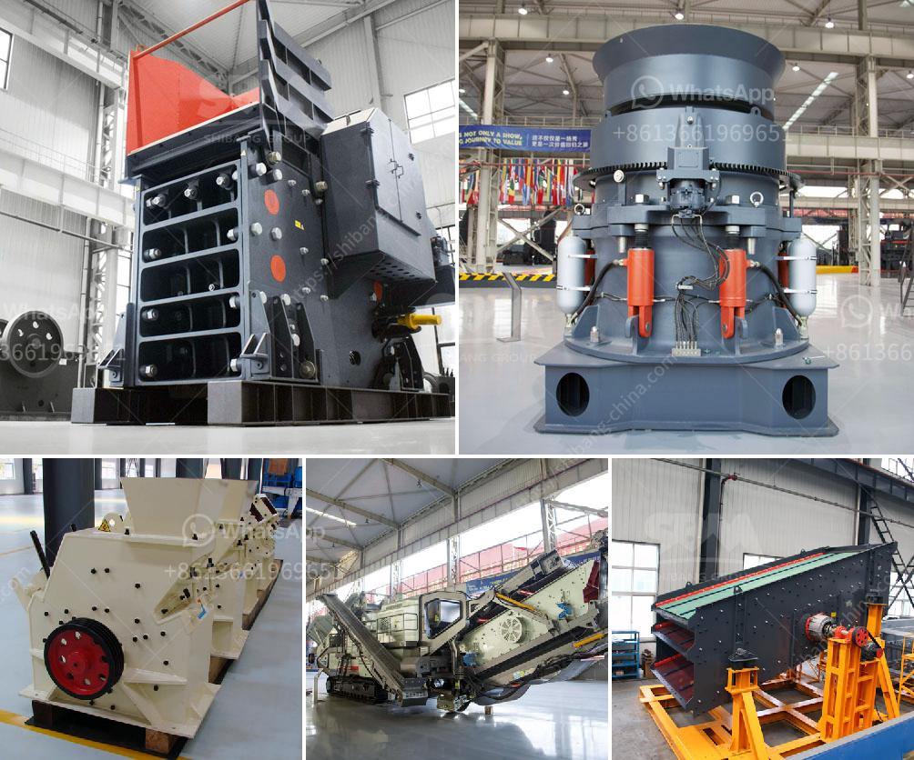

<h3>powder making machinery</h3>
Powder making machinery, also known as powder processing equipment, plays a significant role in various industries' manufacturing processes. It is involved in the production of powdered substances, which are extensively used in industries such as pharmaceuticals, food processing, cosmetics, chemicals, and more. This machinery enables the transformation of raw materials into finely ground powders with remarkable precision and efficiency.

The pivotal aspect of powder making machinery lies in its ability to efficiently grind or pulverize a wide range of materials, including minerals, chemicals, metals, and even granular substances. This versatility allows industries to cater to different product requirements and ensure the desired consistency and quality of the final powdered product.

One of the most common types of powder making machinery is grinding mills or pulverizers. These devices use mechanical force to break down larger particles into smaller sizes, resulting in powders of varying fineness levels. Grinding mills come in various forms, including ball mills, hammer mills, jet mills, and impact mills. Each type has its specific application and advantages, making them suitable for different industries.

Pharmaceutical and chemical industries heavily rely on powder making machinery to produce active pharmaceutical ingredients (APIs), excipients, and specialty chemicals. These industries require consistent and precise particle size distributions to achieve optimal product quality and performance. Powder processing equipment utilizes advanced technologies to control particle size and ensure uniform distribution, helping manufacturers meet strict industry standards and regulations.

The food processing industry extensively employs powder making machinery in the production of spices, seasonings, additives, and powdered ingredients. By grinding raw materials into fine powders, these machines enable uniform blending, enhancing the flavors and textures of food products. Additionally, powdered ingredients have better storage stability and ease of handling, making them highly sought after in the food industry.

Cosmetic manufacturers also benefit from powder making machinery to produce pigments, talc, mica, and other powdered substances used in cosmetics and personal care products. These powders serve various purposes, including adding color, improving texture, and enhancing product performance. The machinery's ability to achieve fine particle sizes and uniform distribution contributes to the successful formulation of high-quality cosmetic products.

With advancements in technology, powder making machinery has evolved and incorporated automation systems, digital controls, and monitoring tools. These features not only enhance the efficiency and productivity of the manufacturing process but also ensure consistency and accuracy in product quality. Manufacturers can monitor and adjust parameters such as particle size, speed, and pressure, resulting in improved control and reduced variability.

In conclusion, the importance of powder making machinery in modern industries cannot be overstated. The ability to transform raw materials into finely ground powders with precision has revolutionized pharmaceuticals, food processing, cosmetics, and various other sectors. This machinery enables manufacturers to meet stringent industry standards, enhance product performance, and achieve overall efficiency in their manufacturing processes. As industries continue to advance, the development and utilization of powder making machinery will undoubtedly play a vital role in their continued growth and success.
<h3>Contact us</h3><ul><li><strong>Whatsapp:&nbsp;<a href="https://wa.me/8613661969651">+8613661969651</a></strong></li><li><a href="https://swt.shibang-china.com/?git&amp;zhl&amp;powder making machinery"><strong>Online Service(chat now)</strong></a></li></ul><h3>Related</h3><ul><li><a href='used stone crushers for sale in accra.md'>used stone crushers for sale in accra</a></li><li><a href='iron ore processing plant design pdf.md'>iron ore processing plant design pdf</a></li><li><a href='how much crusher plant cost.md'>how much crusher plant cost</a></li><li><a href='crusher price sayaji.md'>crusher price sayaji</a></li><li><a href='mini cement plant in west bengal.md'>mini cement plant in west bengal</a></li></ul>