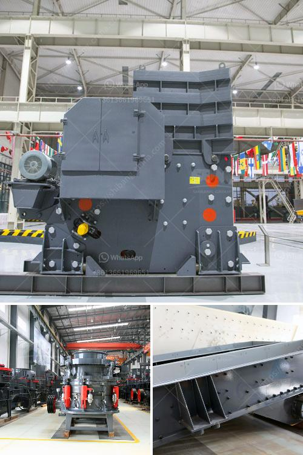

<h3>powder mill rollers machine</h3>
The powder manufacturing industry has seen significant advancements over the years. One such innovation that has revolutionized the way powders are processed is the powder mill rollers machine. This cutting-edge equipment has drastically enhanced the efficiency and quality of powder production, leading to increased productivity and improved end products.

A powder mill rollers machine works by grinding and crushing various materials into a fine powder. It consists of two horizontally placed cylindrical rollers that rotate in opposite directions. These rollers exert immense pressure on the materials as they pass through the grinding chamber, resulting in the desired powder texture.

One of the key advantages of using a powder mill rollers machine is its ability to process a wide range of materials. From minerals, chemicals, and pharmaceuticals to food and agriculture products, this machine can effectively grind and produce consistent powders across various industries. This versatility makes it a valuable asset in any powder manufacturing facility.

Another critical feature of the powder mill rollers machine is its high efficiency. These machines are designed to crush materials with precision and speed, significantly reducing the time and energy required for powder production. This not only improves overall productivity but also lowers operational costs.

Furthermore, the powder mill rollers machine ensures superior powder quality. The precise grinding and crushing action of the rollers result in fine particles with a consistent size distribution. This consistency is crucial for achieving optimal blending, uniform flowability, and superior end-product characteristics, making it highly sought after in industries where powder quality is paramount.

In conclusion, the powder mill rollers machine has revolutionized the powder manufacturing industry. Its ability to process a wide range of materials, high efficiency, and superior powder quality make it an indispensable tool for any powder manufacturing facility. As technology continues to advance, we can only expect further enhancements to these machines, further propelling the powder manufacturing industry into the future.
<h3>Contact us</h3><ul><li><strong>Whatsapp:&nbsp;<a href="https://wa.me/8613661969651">+8613661969651</a></strong></li><li><a href="https://swt.shibang-china.com/?git&amp;zhl&amp;powder mill rollers machine"><strong>Online Service(chat now)</strong></a></li></ul><h3>Related</h3><ul><li><a href='stone crusher machine price in ethiopia.md'>stone crusher machine price in ethiopia</a></li><li><a href='price of diamond mining construction.md'>price of diamond mining construction</a></li><li><a href='hammer mill sales in zimbabwe.md'>hammer mill sales in zimbabwe</a></li><li><a href='limestone grinding mill unit.md'>limestone grinding mill unit</a></li><li><a href='crusher suppliers in kenya.md'>crusher suppliers in kenya</a></li></ul>